[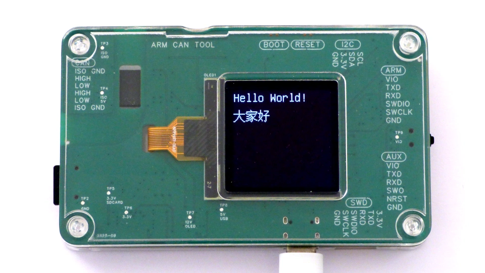](doc/pictures/hello_world.webp)

"arm can tool" is a debugger for ARM and RISC-V targets with a CAN bus interface. It solves the choice between Black Magic Debug and CMSIS-DAP by providing both in one convenient, low-cost tool.

Estimated Manufacturing Cost Per Unit: \$41 (5 units) | \$68 (2 units)

License: Public Domain (CC0) - Free to use, modify, and commercialize.

# Table of Contents

- [Quick Start](#quick-start)
- [Usage](#usage)
- [Hardware](#hardware)
- [Advanced Features](#advanced-features)
- [Firmware](#firmware)
- [Building from Source](#building-from-source)
- [Manufacturing](#manufacturing)
- [Hardware Tests](#hardware-tests)
- [Designed for Repair](#designed-for-repair)
- [Deep Dive](#deep-dive)

# Quick Start

These are instructions for connecting to an ARM SWD target, and writing firmware to target flash.

## Install Firmware

Plug the arm can tool into a USB port. The display should briefly show "Hello World!", and then switch to a menu. USB should detect a new device with two serial ports.

If the display stays black, and the PC does not detect the arm can tool, [install firmware](#firmware) first.

## Initial settings

On the side of the device there is a small black switch that can be moved up and down, or pushed. Use this to navigate the menu system. Move the cursor down, and select the _Display_ submenu. This should say Rotation: 3, Swap Buttons: off.


| 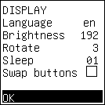 |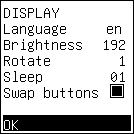|
|---|---|
| Right handed | Left handed |

If left-handed, navigate to the Display menu, choose Rotation: 1, Swap Buttons: on, and select OK. System will reboot in the new settings.

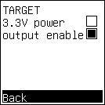

Next, go to the "Target" menu, and check 3.3V power is off, and output enable is on.

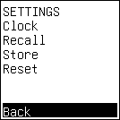

Settings are stored in volatile memory and will be lost when power is removed.
To save the settings permanently, go to the Settings menu and choose _Store_ before turning off the device.

## Connect to Target

[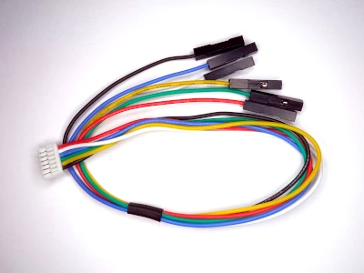](doc/pictures/target_cable.webp)

JST GH 1.25 to Dupont 2.54 cable, silicone wire, 6-pin.

Take a 6-pin JST GH 1.25 to Dupont 2.54 cable, and plug the JST in the connector marked _ARM_.

Connect to the target:

- GND to target ground.
- VIO to target logic power.
- SWCLK to target SWD clock.
- SWDIO to target SWD data.

With the target powered on, download firmware to the target using black magic debug or openocd.

## Basic Debugging with Black Magic Debug
gdb connects directly to black magic debug.

```
$ arm-none-eabi-gdb
(gdb) target extended-remote /dev/ttyACM0
(gdb) monitor swd_scan
Target voltage: 3.325V
Available Targets:
No. Att Driver
 1      STM32F1 L/M density M3
(gdb) attach 1
Attaching to Remote target
(gdb) file ~/Arduino/Blink/build/STMicroelectronics.stm32.GenF1/Blink.ino.elf
(gdb) load
(gdb) run
```

## Basic Debugging with OpenOCD
gdb connects to OpenOCD, and OpenOCD connects to CMSIS-DAP.
Open two shell windows. In the first window, run openocd:

```
 cd /opt/xpack-openocd-0.12.0-4/
./bin/openocd -f ./openocd/scripts/interface/cmsis-dap.cfg -f ./openocd/scripts/target/stm32f1x.cfg
...
Info : Listening on port 3333 for gdb connections
```

In the second window, run gdb:

```
$ arm-none-eabi-gdb
(gdb) target extended-remote :3333
(gdb) file ~/Arduino/Blink/build/STMicroelectronics.stm32.GenF1/Blink.ino.elf
(gdb) load
(gdb) run
```

In practice, the gdb commands would be abbreviated, and the filename would be auto-completed with the "tab" key.
```
$ arm-none-eabi-gdb
(gdb) tar ext :3333
(gdb) fil ~/Arduino/Blink/build/STMicroelectronics.stm32.GenF1/Blink.ino.elf
(gdb) lo
(gdb) r
```

Prebuilt OpenOCD binaries are provided by the [xPack project](https://xpack-dev-tools.github.io/openocd-xpack/docs/install/).

This concludes the quick setup instructions.

# Usage

General information about black magic debug and openocd:

- black magic debug:
    - [online guide](https://black-magic.org/usage/gdb-commands.html)
    - [pdf](https://github.com/compuphase/Black-Magic-Probe-Book/releases/latest/download/BlackMagicProbe.pdf)
- openocd:
    - [online](http://openocd.org/doc/html/index.html)
    - [pdf](http://openocd.org/doc/pdf/openocd.pdf)

- Other debuggers can be used like openocd, using the CMSIS-DAP interface:
    - [pyOCD](https://github.com/mbedmicro/pyOCD)
    - [probe-rs](https://probe.rs/)

## Use Cases

Dual debugger support (Black Magic Debug + CMSIS-DAP) is interesting for embedded developers working with ARM/RISC-V targets, particularly those needing CAN bus capabilities.

Open source debuggers have advanced to the point that it is possible to develop new products by adding a small layer on top of existing software. During development, I had two scenarios in mind:

- Intermittent Bug at Remote Site

    A company provides customer support for CNC machines in remote locations. These products may have intermittent errors, perhaps once a month. A tool that automatically connects to the first processor on the SWD bus, switches on memwatch, rtt, swo, canbus, serials, watchdog and logs everything to sdcard. When an error occurs, remote personnel mails the sdcard to the firmware developer and inserts a fresh sdcard. (attach feature, logging feature)

- Field Technician\'s Tool

    A company has products that are variations upon the same hardware, but each with specific firmware. A tool for field technicians that can be plugged in a product, determines whether product firmware is up to date, and asks permission to update the firmware. This is determining target processor model, calculating a checksum of flash, and a lookup table of firmware versions. (lua feature)

This project would like to be a small step towards making such products reality.

## Target List

The target can be debugged:

- gdb with [black magic debug](https://black-magic.org/index.html).
- gdb with [openocd](https://openocd.org), using CMSIS-DAP

The choice of method depends on whether your target device is supported by the respective tool.

- **Black Magic Debug:**
  Refer to the [Supported Targets](https://black-magic.org/supported-targets.html) list.

- **OpenOCD:**
  To check if a specific target is supported, browse the [OpenOCD GitHub — config scripts directory](https://github.com/openocd-org/openocd/tree/master/tcl/target).

Some manufacturers fork OpenOCD, creating a version specifically for their products.

## Scripting with Lua
The probe can be used standalone, calling CMSIS-DAP or black magic debug from a [lua](https://www.lua.org/docs.html) script.

The firmware contains a lua interpreter. A lua program running in the probe has access to the debug target using CMSIS-DAP and black magic debug. An example of using CMSIS-DAP from lua:

```
msh />lua
> dap.init()
> request=string.char(0) .. string.char(2) .. string.rep("\0", 62)
> dap.process_request(request)
Generic CMSIS-DAP Adapter
```

Within lua, black magic debug can be used to read or write target memory.

```
msh />lua
> bmd.attach()
true
> bmd.mem32_write(0x20001000, "0123456789ABCDEF")
true
> bmd.mem32_read(0x20001000, 16)
0123456789ABCDEF
```

For full list of available lua functions, type `dap.help()` or `bmd.help()`.

For the same task, lua uses more memory than C. Just starting up lua costs 32 kbyte ram.

lua is useful as a rapid prototyping tool.

## Real-Time Clock

To enable the real-time clock, insert a CR1220 battery into the battery holder.

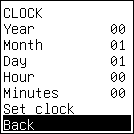

Set the time go to settings -> clock. Set year, month, day, hour and minutes. Choose _set clock_ to set the time. Power cycle and check the time is correct.

## Serial Ports

First, connecting to target console and SWO is described.
Then serial ports are discussed in detail.

### Target Console

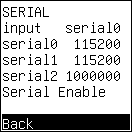

Serial port menu.

Connect the target console to the "ARM" connector, pins TXD and RXD.

In the serial menu, set the speed of serial0 to the speed of the target console. Check input is set to serial0.

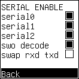

Serial Enable menu.

Enter the Serial Enable menu by choosing "Serial Enable" from the Serial menu.
In the Serial Enable menu, check serial0 is enabled.

Connect a terminal emulator (linux: minicom, windows: putty) to the _second_ usb serial port.
In the terminal emulator you can access the target console.
If the target console does not appear, swap txd and rxd.

### Single Wire Output (SWO)

Connect target SWO to the "AUX" connector, pin SWO.
In the serial menu, set the speed of serial2 to the speed of the target SWO and set _swo decode_: on.
In the USB menu, check serial2 is enabled.

Connect a terminal emulator (linux: minicom, windows: putty) to the _second_ usb serial port.
SWO output appears in the terminal emulator.

### Hardware Serials

Three serials are available to connect to the target: serial0, serial1 and serial2.
Serial speed is any value between 1647 bit/s and 6750000 bit/s.

- serial0 is typically connected to the target console in SWD.
  The checkbox "swap rxd txd" can be used to swap serial port pins, in case a crossed cable is needed.
  serial0 is not available in JTAG mode, only in SWD.

- serial1 is always available, in both SWD and JTAG mode.

- serial2 is a receive-only serial. Use for logging or swo.
  The menu checkbox "swo decode" can be used to decode a SWO stream on this serial.
  The decoded SWO stream is printed on the usb serial port.

- When **serial0** is enabled in the **Settings** menu, serial0 is activated automatically after the ARM CAN tool completes boot initialization, even if the Black Magic Debug interface is not connected to a target device.
  If **Logging** is enabled, all Serial0 activity will also be recorded to the **SD card**.

### usb serials

The arm can tool appears as usb device with two serial ports.

The first usb serial port is the gdb server.

The second usb serial port sends data from serial0, serial1, serial2, swo, rtt, and canbus to the pc host.

Data from the host is sent to serial0, serial1, rtt, or canbus.


Use the menu `serial ->input` to choose where the usb serial port sends data coming from the host.

## CAN Bus Interface

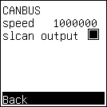

The canbus interface is classic CAN, up to 1Mbit/s. The canbus interface is isolated.

At this moment the software just writes all canbus packets to the usb serial in slcan format. canbus slcan from host to probe needs work.

## User Interface & Display

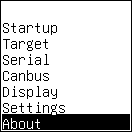

The user interface is functional and menu-driven.
The user interface consists of OLED display and multi-direction switch. The multi-direction switch has four positions: up, down, push, and idle.

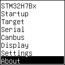

If black magic debug is connected to the target, the target name is the first line of the main menu.

To customize, go to the display menu:


At the moment, only English language is available. But the software is written to allow a single firmware image to show the menus in different languages.

Adjust _Brightness_ according to taste.
_Rotation_ is a value from 0 to 3 that rotates the display 0, 90, 180, or 270 degree.
_Swap buttons_ swaps up and down switch movement.
_Sleep_ is the inactivity timer in minutes before the display switches off. A _sleep_ of 0 keeps the display switched on all the time.

Suggested settings depend upon right or left handedness.

|              | rotation | swap buttons |
| ------------ | -------- | ------------ |
| right-handed | 3        | off          |
| left-handed  | 1        | on           |

Choose preferred settings and select "OK". The system will reboot in the new settings.

# Hardware

The hardware has to be good. The software can always be changed later.

- [Schematics](doc/SCH_Schematic1.pdf)
- [PCB](doc/PCB_PCB1.pdf)

Schematics and pcb design files are at oshwlab [arm_can_tool](https://oshwlab.com/koendv/arm_can_tool).

The board has been designed using [EasyEDA Pro](https://pro.easyeda.com/).

## Block Diagram


Note there are two spi flash chips. The 16 Mbyte qspi flash is used to store the program; the 16 Mbyte spi flash is used to store data (e.g. target firmware files). The qspi flash is written by the bootloader; the spi flash is written the operating system (rt-thread).

## Processor & Features

The [AT32F405](https://www.arterychip.com/en/product/AT32F405.jsp) has:

- 216 MHz Cortex-M4
- 96/102 kbyte RAM
- 256 kbyte zero-wait state flash
- high-speed and full-speed usb
- four-wire qspi in LQFP64

The processor is extended by various chips around it:

- 16 mbyte qspi flash at 108 MHz to store the program
- external i2c eeprom to store settings
- external i2c rtc with battery backup

## Pinout & Connectors

The target JTAG connector is GH1.25, 6-pin.
SWD mode is most common:

| Pin | SWD   |
| --- | ----- |
| 1   | VIO   |
| 2   | TXD   |
| 3   | RXD   |
| 4   | SWDIO |
| 5   | SWCLK |
| 6   | GND   |

In SWD mode, pin 2 and 3 are a serial port, serial 0.

The same connector can also be used for JTAG:

| Pin | JTAG |
| --- | ---- |
| 1   | VIO  |
| 2   | TDI  |
| 3   | TDO  |
| 4   | TMS  |
| 5   | TCK  |
| 6   | GND  |

In JTAG mode, pin 2 and 3 are TDI/TDO JTAG signals.
When using JTAG, serial0 is **switched off**.

The auxiliary connector is GH1.25, 6-pin.

| Pin | Signal |
| --- | ------ |
| 1   | VIO    |
| 2   | TXD1   |
| 3   | RXD1   |
| 4   | SWO    |
| 5   | NRST   |
| 6   | GND    |

Pin 2 and 3 are a serial port, serial 1.
Pin 4 is a receive-only serial, serial 2.
Pin 5 connects to the target reset signal.

The connector marked "SWD" is the swd connector of the AT32F405. Use this connector to debug the "arm can tool" itself.

| Pin | SWD         |
| --- | ----------- |
| 1   | 3.3V        |
| 2   | CONSOLE TXD |
| 3   | CONSOLE RXD |
| 4   | SWDIO       |
| 5   | SWCLK       |
| 6   | GND         |

The SWD connector is GH1.25, 6-pin. Pins 2 and 3 are the rt-thread console. The console has a shell prompt.

```
msh />ls /
Directory /:
sdcard              <DIR>
flash               <DIR>
```

The CAN bus connector is GH1.25, 6-pin.

| pin | signal          |
| --- | --------------- |
| 1   | ISOLATED GROUND |
| 2   | CAN_HIGH        |
| 3   | CAN_LOW         |
| 4   | CAN_HIGH        |
| 5   | CAN_LOW         |
| 6   | ISOLATED GROUND |

A small cable then goes from "arm can tool" connector to the canbus.
An example cable from 6-pin GH1.25 to two 4-pin GH1.25:

[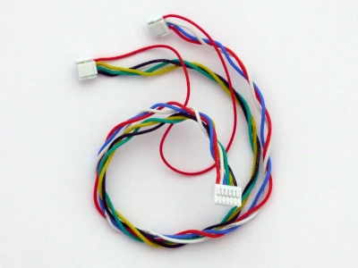](doc/pictures/canbus_cable.webp)

This cable can be made by hand from a GH1.25 6-pin and a GH1.25 4-pin cable, or ordered from [lcsc](https://www.lcsc.com/customcables), \$4.84.
[cable wiring diagram](doc/canbus_cable.pdf)

Note the debugger has no internal CAN bus terminating resistors. If the tool is the last device on the bus, and a terminating resistor is needed, put a 120R resistor on the JST GH connector.

## Voltage Translators & Target Power

The probe uses level translators to convert from target voltage to probe 3.3V. The 74AVC4T77 level translators used accept logic voltages from 1.1V to 3.6V. Other level translators can be used to provide different voltage ranges.

The translators need to know the target logic voltage to work.

Either

- connect VIO to target VCC (preferred)
- connect VIO to 3.3V internally (only if target voltage is 3.3V, too)

Connecting VIO to 3.3V can be done from the menu "Target" or from the command line, using gdb.
From the "Target" menu:


From the command line:

```bash
 $ arm-none-eabi-gdb
(gdb) tar ext /dev/ttyACM0
Remote debugging using /dev/ttyACM0
(gdb) mon tpwr ena
Enabling target power
(gdb) mon tpwr dis
Disabling target power
```

This may be used to power a 3.3V target from the debugger, if target power requirements are modest.

## Automating Target Reset

The NRST pin on the AUX connector can be connected to the target’s reset line. This connection allows the debugger to control and reset the target device programmatically.

Some processors require the reset signal to be asserted during SWD or JTAG connection to enable successful communication.

There are two ways to achieve this: manual or automated.

- **Manual reset**
Briefly press the target’s reset button while initiating the debugger connection.
- **Automated reset via AUX connector**
Connect the NRST pin on the arm can tool AUX connector to the target’s reset line and configure the debugger to assert reset during connect:

    - Black Magic Debug:

    ```(gdb) monitor connect_rst enable```

    - OpenOCD:

    ```reset_config srst_only srst_push_pull connect_assert_srst```

This setup ensures the debugger properly asserts the reset signal when establishing a debug connection. The ```(gdb) monitor reset``` command can be used to reset the target.

## PCB Notes

### Manufacturing Goal
The PCB is designed for manufacturing using JLCPCB's "economic" PCB assembly process. For successfull assembly, ensure all components are in stock before ordering. If not all components are in stock, choose substitutes. Document substitutes by listing substitutes under the component in the schematic.
Use “repeat order” option for subsequent batches.

### High-Speed Connections

- USB 2.0 Link:
    - Maximum speed: 480 Mbit/s.
    - USB connector is placed directly in front of the AT32F405 USB pins, ensuring straight traces for optimal signal integrity.
- QSPI Flash Interface
    - Clock frequency: 108 MHz.
    - All QSPI traces are length-matched  and impedance-controlled to maintain signal quality.

### PCB Layout Considerations

For SPI2_MISO and AUX_SWO traces on the bottom layer, the VCC plane beneath the traces is replaced with a ground plane to provide a proper return current path.

The PCB includes an SD card connector that supports hot insertion.
- SD cards can present up to 10 µF bulk capacitance on the power supply pins.
- A load switch is used to limit inrush current during insertion.

## CAN Bus Isolation

- 8 mm clearance between CAN and logic sides provides ample margin for typical CAN bus voltages.
- The FR4 material (CTI ≥ 175 V) is suitable for standard applications, but not rated for high-voltage isolation.
- Flux residue remains on the PCB as part of the production process; this can create leakage paths, especially in the presence of humidity or condensation.
- No conformal coating is applied. The board is not protected against moisture, dust, corrosion, or environmental contaminants such as oils, salts, or airborne chemicals.
- ⚠️ This design is not intended for high-voltage use. Use only in clean, controlled environments.

# Advanced Features

Compared to upstream black magic debug, two additions: memwatch and rtt halt.

## Memwatch - Live Memory Monitoring

A new gdb monitor command is added, _memwatch_.
The memwatch command reads target memory while the target is running.
Inspecting memory without halting the target is useful when debugging hard real time systems.

The arguments to "mon memwatch" are names, formats, and memory addresses. Up to 8 memory addresses may be monitored at the same time. The "mon memwatch" command can be applied to Arm Cortex-M targets only.

### Memwatch Example

Assume target firmware contains a variable called "counter". In gdb:

```
(gdb) p &counter
$1 = (<data variable, no debug info> *) 0x20000224 <counter>
(gdb) mon memwatch counter /d 0x20000224
0x20000224
(gdb) r
```

When the variable changes, output is written to the usb serial:

```
counter 0
counter 1
counter 2
counter 3
counter 4
```

To switch off, enter "mon memwatch" without arguments.

```
(gdb) mon memwatch
```

### Memwatch Arguments

The command arguments in detail:

```
mon memwatch [/t] [[NAME] [/d|/u|/f|/x] ADDRESS]...
```

Up to 8 addresses of watchpoints may be specified.

```
mon memwatch x1 /d 0x20000224 x2 0x20000228 x3 0x2000022c x4 0x20000230 x5 0x20000234 x6 0x20000238 x7 0x2000023c x8 0x20000240
```

NAME begins with a letter a-z A-Z. NAME is printed on every line of output. If NAME has been omitted, the address is printed instead:

```
(gdb) mon memwatch /d 0x20000224
```

prints

```
0x20000224 0
0x20000224 1
0x20000224 2
0x20000224 3
0x20000224 4
```

Format is one of

- /d signed 32-bit integer
- /u unsigned 32-bit integer
- /f 32-bit float
- /x hex 32-bit integer
- /t timestamp in ms

If format is not given, default is hex, or the last used format.

```
(gdb) mon memwatch counter 0x20000224
```

prints

```
counter 0x0
counter 0x1
counter 0x2
counter 0x3
counter 0x4
```

Address is a hexadecimal number. The address is the minimum necessary to define a watchpoint.

```
(gdb) mon memwatch 0x20000224
```

prints

```
0x20000224 0x0
0x20000224 0x1
0x20000224 0x2
0x20000224 0x3
0x20000224 0x4
```

The '/f' format prints IEEE754 32-bit single-precision "float":

```
(gdb) mon memwatch counter /d 0x20000224 root /f 0x20000248
```

prints

```
counter 0
root 0
counter 1
root 1
counter 2
root 1.41421
counter 3
root 1.73205
counter 4
root 2
```

The /f format defaults to printing to 6 decimal places "%.6g".
Optionally, /f may be followed by a digit, indicating the number of decimal places.
Example: /f4 prints floating-point numbers to four decimal places.

The '/t' format prints a timestamp in milliseconds:

```
(gdb) mon memwatch /t counter /d 0x20000224
```

prints

```
20601 counter 0
20613 counter 1
21613 counter 2
22613 counter 3
23613 counter 4
```

To obtain memwatch status:
```gdb
(gdb) mon memwatch counter /d 0x20000224 root /f 0x20000248
0x20000224 0x20000248
(gdb) mon memwatch status
address    variable    fmt value
0x20000224 counter      s  0
0x20000248 root         f6 0
(gdb)
```

## RTT Halt Control

On some target processors it may be necessary to halt the target while rtt data is copied from target to debugger.

- `mon rtt halt enable` always halt the target processor during rtt.
- `mon rtt halt disable` never halt the target processor during rtt
- `mon rtt halt auto` default is never halt the target processor during rtt. Only halt target processor on:
  - risc-v that have no system bus
  - TM4C123GH6PM (XXX check)

Default is `mon rtt halt auto`. Note many rtt problems are cache problems.

## RTT Startup

If rtt is slow to connect, consider using gdb with python extensions to specify the control block address. Two example scripts:

- [script for black magic](tools/rtt.bmd)
- [script for openocd](tools/rtt.openocd)

## Logging to SD Card

To switch on logging, go to menu "Mode" and select "logging".
Next, go to menu "Settings" and select "Store".
Reboot.

Logging can be switched on in menu "Mode".
Log files are written to sdcard. Please insert a dos formatted sdcard before switching logging on. Make sure the sd card has a directory "log".

There are two sets of log files, one for rt-thread and one for black magic debug.

The rt-thread system log is written to /sdcard/log/rtthread.log
If the system log grows too large, the logfile is rotated: rtthread.log.1

The output from black magic debug (auxiliary port) is written to /sdcard/log/log_0000.txt
If the log grows too large, logging switches to another file: log_0001.txt

Console commands:
The `ulog` command logs its arguments to the rt-thread system log.

```
ulog hello, world!
```

The `ulog -c` command switches console logging off. Logging to file is unchanged.

The `logger` command logs its arguments to the black magic log.

```
logger hello, world!
```

The `logger -f` command flushes the log from ram buffers to sdcard.

```
msh />logger -f
I/LOG: flush
```

Logging only works if there is an sd card.

## Watchdog

To switch on the watchdog, go to menu "Mode" and select "watchdog".
Next, go to menu "Settings" and select "Store".
Reboot.

If the system is unresponsive for 20 seconds, and the watchdog is switched on, the system will reboot.

## Startup Menu

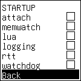

The **startup menu** allows the ARM CAN Tool to automatically initialize debugging and monitoring services at boot.
Enables continuous, unattended system observation and data logging for capturing intermittent or long-duration faults.

Available startup services:

- **attach**
  Automatically connects to the first processor detected on the SWD bus. Equivalent to:

    ```gdb
    (gdb) monitor swd_scan
    (gdb) attach 1
    ```

- **memwatch**
Enables variable watchpoints as configured at the time of Settings → Store.
- **rtt / swo / canbus / serials**
Activates the corresponding communication and logging interfaces.
- **logging**
Records all available output channels (serial, SWO, RTT, CAN, memwatch) to the SD card.
- **lua**
If a formatted SD card is present and contains an `autoexec.lua` file, the script is executed at startup. Increase the Lua stack size if necessary.
- **watchdog**
Automatically reboots the system if it becomes unresponsive.

Typical Use Cases:

- Field and endurance testing
- Remote or offline system monitoring
- Automated test and validation setups
- Long-term reliability and stability testing
- Automatic crash and fault data collection

## Power

Power consumption of "arm can tool", as measured on the usb connector.

| description                           | current |
| ------------------------------------- | ------- |
| no sdcard, display blanked            | 60-65mA |
| no sd card, display text              | 80-85mA |
| writing to sdcard, display 100% white | 200mA   |

The USB power is 5.0V nominal, and the device operates within a voltage range of 4.5V to 5.5V.

# Firmware

The AT32F405 firmware consists of two binaries:

- bootloader in internal flash
- application in external qspi flash

Both have to be installed.

## Installing the Bootloader

The bootloader binary is `cherryuf2_arm_can_tool.bin`.

Download the bootloader binary from [at32f405-uf2boot](https://github.com/koendv/at32f405-uf2boot).

To install the bootloader using dfu-util:

- connect the board to usb
- push reset and boot0 buttons
- wait one second
- release the reset button
- wait one second
- release the boot0 button

At this point, the at32f405 ought to be in DFU mode:

```
$ lsusb
...
Bus 003 Device 012: ID 2e3c:df11 Artery-Tech DFU in FS Mode
```

With the firmware `cherryuf2_arm_can_tool.bin` in your current directory, execute the following command:

```
dfu-util -a 0 -d 2e3c:df11 --dfuse-address 0x08000000 -D cherryuf2_arm_can_tool.bin
...
Erase       [=========================] 100%        23692 bytes
Erase    done.
Download    [=========================] 100%        23692 bytes
Download done.
File downloaded successfully
```

This completes installing the bootloader.

Linux users: If dfu-util does not see the at32, execute dfu-util as root with `sudo` or set up udev-rules:

```
 Artery AT32 DFU
 Copy this file to /etc/udev/rules.d/99-at32.rules and run: sudo udevadm control -R
SUBSYSTEMS=="usb", ATTRS{idVendor}=="2e3c", ATTRS{idProduct}=="df11", TAG+="uaccess", MODE="0664", GROUP="plugdev"
```

Windows users: If dfu-util does not see the at32, download [zadig](https://zadig.akeo.ie/), install the WinUSB driver and run dfu-util again.

The bootloader prints either "app" or "dfu" on the console.

### dfu

dfu is the abbreviation of _Device Firmware Update_. When the multi-direction switch is pressed during boot, the boot loader waits for a uf2 file. Console output:

```
102k ram
dfu
[SFUD]Found a Winbond flash chip. Size is 16777216 bytes.
[SFUD]qspi1 flash device initialized successfully.
```

### app

App is the abbreviation of _APPlication_. When the multi-direction switch is not pressed during boot, the boot loader starts the operating system. Console output:

```
102k ram
app

 \ | /
- RT -     Thread Operating System
 / | \     5.2.2 build Oct 12 2025 13:57:52
```

## ram size

A note about processor ram size.
The at32f405 cpu has 96k ram if ram parity check is enabled, 102k ram if ram parity check is not enabled (default).
"arm can tool" has been compiled for 102kbyte ram.
If the bootloader prints "96k ram", the processor option bits need a reset.

## Installing the Application

The bootloader is used to install the application.

From [arm can tool github](http://github.com/koendv/arm_can_tool) download the application binary `rtthread.uf2`.

To install the application using the bootloader, use the multi-direction switch. The multi-direction switch is a small black joystick.

- connect the board to usb
- push reset and multi-direction switch
- wait one second
- release the reset button
- wait one second
- release the multi-direction switch
- The green led switches on. On the pc a usb mass storage appears. In the mass storage there is a file `CURRENT.UF2`
- copy the file `rt-thread.uf2` to the file `CURRENT.UF2`. This writes firmware to flash. The led blinks during firmware update.

    `cp rtthread.uf2 /media/$USER/CherryUF2/CURRENT.UF2`

- when firmware update is finished, the "arm can tool" resets, and the oled display shows the menu.

This completes installing the application.

# Building from Source

To build the firmware from source, three options:

- The [arm can tool git](https://github.com/koendv/arm_can_tool/actions) contains a github workflows action that will compile firmware.
- [Dockerfile](tools/docker/Dockerfile) for build
- [Building on linux](doc/BUILDING.md) - notes to compile on linux, from the shell prompt.

These are builds on ubuntu linux.

## Software Architecture


"arm can tool" contains two debuggers:

- [black magic debug](https://github.com/blackmagic-debug/blackmagic), a gdb server
- [free-dap](https://github.com/ataradov/free-dap), a free and open source cmsis-dap implementation

The difference between black magic debug and free-dap (cmsis-dap) is the debugger software on the pc. gdb on the pc can connect to black magic debug directly. gdb on the pc requires [openocd](https://github.com/openocd-org/openocd) to connect to free-dap.

[Cherry usb](https://github.com/cherry-embedded/CherryUSB) is an open source usb protocol stack. Within "arm can tool", cherry usb connects black magic debug and free-dap to different usb endpoints. The interaction between black magic debug and free-dap is minimal.

[mui](https://github.com/olikraus/u8g2/wiki/muimanual) (minimal user interface) runs a small text menu on the oled display. mui is part of [u8g2](https://github.com/olikraus/u8g2/wiki), a lightweight graphics library. Navigating the menus is through a small multi-direction switch (joystick).

One of the differences between "black magic debug" and "arm can tool" is that

- "black magic debug" settings are gdb "monitor" commands, and are lost when power is removed.
- "arm can tool" settings are through the display menu, and saved in eeprom. The saved settings are restored at boot.

## Minimal User Interface

The user interface should be frugal with cpu and memory. If the display does not change, no cpu should be used.


Display controllers were tested for speed and memory. Color controllers use too much memory. Greyscale controllers are slower than black and white controllers. SPI controllers were preferred over I2C controllers, as less likely to hang, even if the display is not plugged in. Various black and white OLED display controllers were tested, and the fastest chosen.

The display is 128\*128 black and white only, sh1107 SPI controller. This combines speed and using as little ram as possible.

The display is square, which makes changing display orientation easy.

The small multi-direction switch is debounced in both hardware and software, and generates one clean interrupt per press. There is no need for polling in software.

Graphics software is u8g2 with [minimal user interface](https://github.com/olikraus/u8g2/wiki/muimanual#mui) (mui). u8g2 was originally written for a 16MHz 8-bit processor. On a 216MHz 32-bit processor the software flies.

Yes, the probe has an interactive display - but everything has been done to make the display as lightweight as possible.

## UTF8 & Fonts


The user interface supports displaying UTF8 characters. The font used is [GNU Unifont](https://www.unifoundry.com/unifont/). Latin characters are variable width; Chinese characters are 16x16. To conserve flash memory, the font only contains the characters used in the menus.

After editing the menu, if new characters have been introduced, please run the command `update_unifont.sh`. This updates the font to contain all characters used.

```bash
cd arm_can_tool
./tools/update_unifont.sh
```

u8g2 issues: [#2627](https://github.com/olikraus/u8g2/pull/2627) [#2656](https://github.com/olikraus/u8g2/issues/2656)

# Manufacturing

[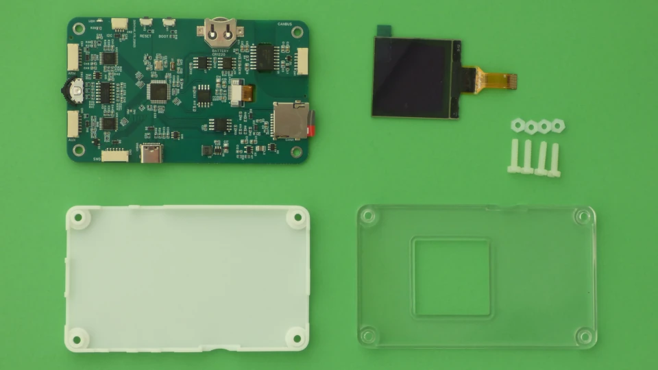](doc/pictures/assembly.webp)

The picture shows all components needed to assemble one device:

- board
- OLED display
- 3d shell back, in white resin
- 3d shell front, in transparent resin
- 4 M3 10mm screws and 4 M3 nuts.
- 4 self-adhesive rubber feet, 6mm diameter (option)

The board can be made in small quantity (2 or 5) using jlcpcb "economic" pcb assembly. It is more economical to assemble several boards at a time. Manufacturing boards five at a time, and selling one by one in aliexpress would be ideal.

<div class="page-break"></div>

## PCB Assembly

Steps to order an assembled board.

### JLCPCB

[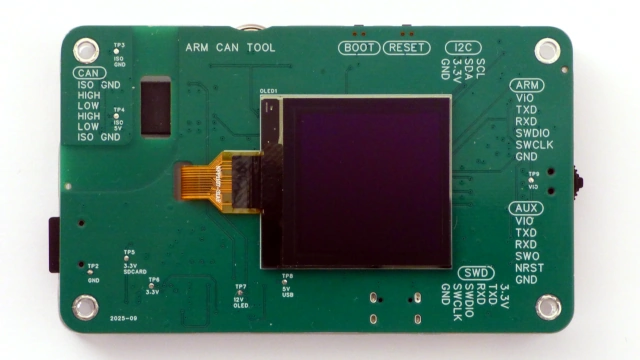](doc/pictures/pcb_front.webp)

[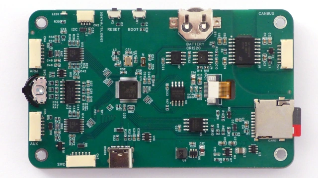](doc/pictures/pcb_back.webp)

The board is assembled at jlcpcb using "economic" assembly. All components are smd components. No manual soldering is needed.
The complete hardware design (schematic, PCB, and BOM) is published on OSHWHub: [arm_can_tool)(https://oshwlab.com/koendv/arm_can_tool).

During the ordering process:

- Stackup: JLC04161H-7628
- Mark on PCB: Order Number (Specify Position).
- PCBA Qty: 2 or 5, choose.
- PCBA Remark: NO SOLDER PASTE ON MIDDLE PAD OF BATTERY HOLDER C964818

JLCPCB prints the order number on the board.
The [position of the order number on the board](https://jlcpcb.com/help/article/How-to-remove-order-number-from-your-PCB) is specified to avoid the order number accidentally being placed in the canbus isolation barrier. Silkscreen text in the canbus isolation barrier lowers the maximum allowed voltage.

Do not request _ultrasonic_ board cleaning. The board contains the DS3231 real-time clock with built-in crystal. The DS3231 datasheet says ultrasonic cleaning should be avoided to prevent damage to the crystal.

PCB assembly cost, without shipping and tax: \$115 for 2, \$153 for 5. (07/2025)

## Sourcing Components

### Processor

The processor AT32F405RCT7-7 C9900094935 is a consigned part. A consigned part is a part supplied by the customer to jlcpcb.

The AT32F405RCT7-7 was consigned as follows: superbuy.com, a Chinese shopping agent, bought the processors at taobao.com, and forwarded the parcel to the jlcpcb warehouse.
Please [follow jlcpcb instructions](https://jlcpcb.com/help/article/how-to-consign-parts-to-jlcpcb) exactly.
Cost was $17.5 for 10 processors.

<div class="page-break"></div>

### OLED

[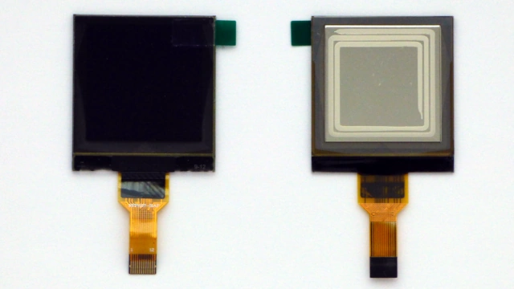](doc/pictures/oled128x128_sh1107.webp)

The OLED display used is [ZJY150-2828KSWKG03](doc/ZJY150-2828KSWKG03.pdf). This is a 1.5", 128x128 pixel, SH1107 driver, SPI interface, 12 pin OLED. The display can be ordered from

- [alibaba](https://www.alibaba.com/product-detail/1-5-inch-OLED-display-module_1601054555841.html)
- [aliexpress](https://www.aliexpress.com/item/1005007579159330.html)
- [taobao](https://item.taobao.com/item.htm?id=756962244579)

Choose the 12pin connector with SPI. Cost is \$3.50.

<div class="page-break"></div>

## 3D Printed Case

[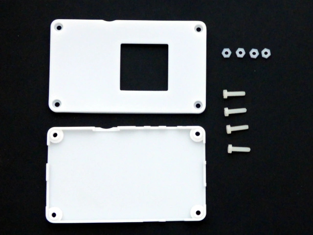](doc/pictures/3d_printed_case.webp)

Picture of a case in white 9600 resin.

The Easyeda project includes a case. The case consists of two parts, top and bottom, connected using 4 M3x10 nylon screws and nuts. For the case design files, in the Easyeda project open the PCB; see layers "3D Top", "3D Bottom", "3D Outline". To generate the STL files, choose Export->3D Shell File. The case was printed at [jlc3dp](https://jlc3dp.com).

Case dimensions are 60 * 100 * 14mm. The pcb is a structural part of the case. The pcb gives the case its stiffness.

The case can be 3D printed from different materials. Each material has its use.

<div class="page-break"></div>

### Prototype for Testing

[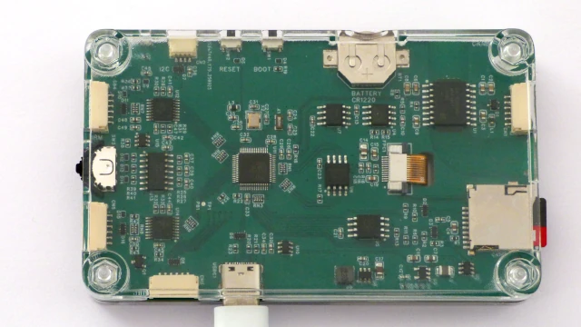](doc/pictures/clear_case.webp)

The case for the prototype was made in clear, transparent plastic (SLA, 8001 resin). A transparent case allows seeing whether there is sufficient space between case, pcb and connectors.

Assume any electronics device will fall at least once from a table to a hard floor. A prototype was intentionally dropped from a table. The clear case allowed checking there was no damage, without opening the case.

### Production Case

For production, choose the cheapest case that works.
The board has two sides: display and components.

For the component side, the cheapest resin was chosen, SLA 9600 resin.

For the display side. transparent 8100 resin was chosen. Transparent resin allows reading the connector pin names printed on the pcb. It is cheaper to use a transparent case with text on the pcb, than to use a white case, and print text on the case.

The case is printed in SLA.

| Side      | color       | jlc3dp     | pcbway   |
| --------- | ----------- | ---------- | -------- |
| display   | transparent | 8100 resin | UTR-8100 |
| component | white       | 9600 resin | UTR-8360 |

Cost is about \$4.50, mainly because of the transparent part. If the case is printed in the cheapest (non-transparent) resin, cost is about \$1.50.

### Heatproof

The above resins may be sufficient for office use. But these resins begin to deform at 53°C to 59°C. This is roughly the temperature of the dashboard of a car parked in the sun.
If a heatproof case is desired, perhaps choose "JLC Temp Resin" (jlc3dp, 101°C) or "Somos Perform" (pcbway, 122℃). Nylon also works, but is more coarse to the touch.

## Total Cost

Based on the data above, the total cost (excluding shipping and tax) is as follows:

|          |Quantity 2 |Quantity 5 |
| -------- | --------- | --------- |
|board     |57.5       |30.6       |
|processor |1.75       |1.75       |
|display   |3.5        |3.5        |
|case      |4.5        |4.5        |
|total     |67.25      |40.35      |

## Assembly Instructions

1. Thread the OLED flexible cable through the PCB.
2. Plug the OLED flexible cable into the PCB connector.
3. Fix the OLED display to the PCB using double-sided tape.
4. Close the enclosure using four nylon M3 × 10 mm screws and nuts.
5. Attach the 6 mm diameter self-adhesive rubber feet.

**Caution:**

Do not glue the OLED display before connecting the cable to the PCB connector. Ensure the cable is properly plugged in before securing the display with adhesive.

# Hardware Tests

Hardware tests for:

- power supply
- crystals
- i2c
- spi flash

and others

## Power Supplies

With a multimeter, use the test pads on the display side of the board to check the power supplies:

| Voltage   | Range       | Reference | Note                                                                                                                                              |
| --------- | ----------- | --------- | ------------------------------------------------------------------------------------------------------------------------------------------------- |
| 5V USB    | 4.75-5.25V  | GND       | from USB                                                                                                                                          |
| 3.3V      | 3.3V        | GND       | main power                                                                                                                                        |
| 12V OLED  | 11.7-12.4V  | GND       | 12.1V typical                                                                                                                                     |
| 3.3V SDCARD | 3.3V        | GND       | SD card voltage range is 2.7-3.6 V. Inrush current limit. Switched on by firmware when a SD card is present. Switched off when a card is removed. |
| VIO       | 1.1V - 3.6V | GND       | Target VCC for voltage translators. Powered by target or probe. See "voltage translators" how to power VIO from the probe.                        |
| ISO 5V    | 5.1V        | ISO GND   | 5V isolated, for CANBUS transceiver. transceiver voltage range is 4.5-5.5V.                                                                       |

## Console

Install firmware. Connect a vt100 terminal emulation to the connector "SWD", pins RXD and TXD, 115200 8N1. Check the console prompt appears.

Check the boot message for errors. This is a clean boot with sdcard inserted:

```
102k ram
app

 \ | /
- RT -     Thread Operating System
 / | \     5.2.2 build Oct 12 2025 13:57:52
 2006 - 2024 Copyright by RT-Thread team
[u8g2] Attach device to spi22
I/EEPROM: settings loaded
I/UART: uart2 speed 115200
I/UART: uart3 speed 115200
I/UART: uart7 speed 115200
I/CAN: can1 speed 1000000
I/SFUD: rom mount to '/'
I/SFUD: Found a flash chip. Size is 16777216 bytes.
I/SFUD: norflash0 flash device initialized successfully.
I/SFUD: Probe SPI flash norflash0 by SPI device spi20 success.
I/SFUD: spi flash mount to /flash
I/SD: sd card mount to /sdcard
I/MAIN: ready
msh />
```

## Crystals

Do not measure oscillator frequency touching the crystal with an oscilloscope probe; the capacitance of the probe will change the oscillator frequency slightly.

To accurately measure HSE and LSE oscillator frequency, use the `clkout_12m` and `clkout_32k` commands.

### 12 MHz crystal

from the console prompt, execute

```
msh />clkout_12m
```

A 1MHz square wave appears on pin PB13. Measure on the resistance connected to PB13. The signal on PB13 is the system clock divided by 12.

### 32768 kHz crystal

from the console prompt, execute

```
msh />clkout_32k
```

A 32768 Hz square wave appears on pin PB13. Measure on the resistance connected to PB13.

## Real-Time Clock

Insert a CR1220 battery in the battery holder. Set the time.

Example: for July 14, 2025, 12:07:00 hours:

```
msh />ds3231 date 2025 07 14 12 07 00
msh />ds3231 date
2025 7 14 12 7 35
```

Reboot. With the external rtc set, the internal rtc should now have the same time as the external rtc:

```
msh />date
local time: Mon Jul 14 12:08:49 2025
timestamps: 1752466129
timezone: UTC+08:00:00
```

## I2C Bus

Run `i2c_scan` to see devices on the internal I2C bus:

```shell
msh />i2c_scan
    00 01 02 03 04 05 06 07 08 09 0A 0B 0C 0D 0E 0F
00:                         -- -- -- -- -- -- -- --
10: -- -- -- -- -- -- -- -- -- -- -- -- -- -- -- --
20: -- -- -- -- -- -- -- -- -- -- -- -- -- -- -- --
30: -- -- -- -- -- -- -- -- -- -- -- -- -- -- -- --
40: -- -- -- -- -- -- -- -- -- -- -- -- -- -- -- --
50: 50 -- -- -- -- -- -- -- -- -- -- -- -- -- -- --
60: -- -- -- -- -- -- -- -- 68 -- -- -- -- -- -- --
70: -- -- -- -- -- -- -- -- -- -- -- -- -- -- --
```

These devices are:

- AT24C256 EEPROM (0x50)
- DS3231 RTC (0x68)

Plug an i2c device in the qwiic connector for the external i2c bus. Run `i2c_scan i2c3` and check the device appears.

## Flash

The board has 16MB spi flash. Benchmark the flash from the command prompt. Running the benchmark erases the flash completely.

```shell
Probed a flash partition | flash | flash_dev: norflash0 | offset: 0 | len: 16777216 |.
msh />fal bench 4096 yes
Erasing 16777216 bytes data, waiting...
Erase benchmark success, total time: 39.097S.
Writing 16777216 bytes data, waiting...
Write benchmark success, total time: 157.395S.
Reading 16777216 bytes data, waiting...
Read benchmark success, total time: 17.782S.
```

Reading is about 1 MByte/s. Writing is ten times slower than reading.

## SD Card

Insert an sd card formatted in FAT32.

```
msh />
I/SD: sdcard mount
I/SD: sd card mounted on /sdcard
msh />ls /sdcard/
Directory /sdcard/:
```

Remove the sd card. Check the console logs this.

```
I/SD: sdcard unmount
```

## Target Reset

The target reset pin can be brought low by the debugger, or by pushing the reset button on the target. Because of this, there are two pins for the target reset:

- target reset out: driven low when the debugger wants to reset the target

- target reset in: low when the target is in reset

A small command, `trst`, allows testing the target reset hardware.

```
msh />trs
trst
msh />trst high
trst_out high
trst_in low
msh />trst low
trst_out low
trst_in high
```

## CAN Bus

With an unpowered, unconnected board, using a multimeter, check the resistance between the test pads GND and ISO GND. Multimeter should show "open circuit".

Go to the canbus menu.


Set canbus speed in the menu. Check _slcan output_ is selected.

Connect to the _second_ usb serial. On Windows, use putty. On linux:

```
minicom -D /dev/ttyACM1
```

Connect the tool to a canbus. Check that canbus packets are printed in slcan format on the usb serial port.

From the rt-thread console shell prompt, type

```
msh> canbus send
```

This sends a packet, ID=001, Data=01 23 45 67 89 AB CD EF. Verify the nodes on the bus see the packet.

# Designed for Repair

The device has been designed to allow manual repair.

If you can repair mobile phones you can repair this.

If a voltage level translator, canbus transceiver, or one of the SOIC or LQFP components fails, try the following:

- cover the other components with Kapton tape. Leave only the component that needs replacing uncovered.
- under microscope, using a scalpel or sharp cutter, with patience, cut the component pins until the ic body is free
- using a generous amount of flux, unsolder the pins one by one
- remove excess solder using copper braid
- clean with isopropyl alcohol
- apply flux, solder new ic in place

If needed, the processor can also be replaced this way. You should find there is enough room around these components to swipe a soldering iron across the pins.

This method fails for the 4x33R resistor arrays, or the H5VU25U ESD protection, as there are no pins to cut through. For these components, use hot air.

# Deep Dive

This project is a product of global collaboration and the open-source ecosystem. The core debugging software, [Black Magic Debug](https://black-magic.org/), was created by an international community of developers. This software is combined with other open-source components like the [RT-Thread](https://www.rt-thread.io/) operating system and the [CherryUSB](https://github.com/cherry-embedded/CherryUSB) stack. To create the hardware to bring it all to life, the design leverages the modern, accessible ecosystem of [EasyEDA](https://easyeda.com/) for design, the [AT32F405](https://www.arterychip.com/) microcontroller with strong performance at reasonable cost, and efficient on-demand manufacturing through partners like [JLCPCB](https://jlcpcb.com/). It demonstrates how open-source software and globally accessible hardware can come together to create a powerful, low-cost tool for developers everywhere.

## Critique

Compare arm can tool and the original black magic probe. There are differences in usb, cpu, ram and operating system. What does this mean for the black magic probe gdb server?

|                  |cpu       |clock  |usb       |
| ---------------- | -------- | ----- | -------- |
|black magic probe |STM32F103 |72MHz  |12 Mbit/s |
|arm can tool      |AT32F405  |216MHz |480Mbit/s |

With usb 1.1, the processor was faster than the usb.
With usb 2.0, the usb is faster than the processor.

So even though the processor is 3 times faster, we are slower, because usb speed has increased 40 times.

What was efficient for data arriving at 12 Mbit/s on a 72MHz processor is not efficient for data arriving at 480Mbit/s on a 216MHz processor.

Right now the gdb server of black magic debug uses a function (gdb_if_getchar()) to poll whether usb has a character available, and reads usb data one character at a time. Instead of the gdb server polling usb to read one character at a time, it would be better for the usb to do a callback to the gdb server when a packet is available.

|                  |cpu       |memory    |usb packet |
| ---------------- | -------- | -------- | --------- |
|black magic probe |STM32F103 |32 kbyte  |64 bytes   |
|arm can tool      |AT32F405  |102 kbyte |512 bytes  |

Memory is another issue. usb 1.1 packets are at most 64 byte, usb 2.0 packets at most 512 byte. So even though processor memory has increased more than 3 times, from 32 kbyte to 102 kbyte, we have to be more careful with memory, because usb packets are now 8 times larger.

Unfortunately, right now usb reads data in one buffer, that gets copied in a ring buffer, that gets copied one character at a time into the gdb server buffer. This is wasteful in memory. The reason is that the gdb server wants to read usb data one character at a time. gdb_if_getchar() is the bottleneck.

To reduce memory requirements, stream parsing of gdb packets would help. This requires the gdb server processing the gdb protocol without buffering the full gdb packet.

Finally, the operating system. On the original black magic probe there was just one process - black magic debug. If there is only one process, polling is acceptable. But on rt-thread the gdb server is just one process out of a dozen. On rt-thread, polling means 100% cpu load, with the gdb server starving other processes. A callback mechanism would reduce cpu load from 100% to near idle.

It might be necessary to split the gdb server in two parts: one a process that polls the target periodically, to see whether the target is still running or has encountered an exception, breakpoint or watchpoint. The other a callback, passing a usb packet from usb stack to gdb server, to execute a command from gdb. The delicate part is semihosting, where the target halts and sends a request to gdb, e.g. file i/o on the host pc. Processing the answer from gdb to a semihosting request requires thread synchronisation between the process that polls the target and the gdb server.

Conclusion:

- replace gdb_if_getchar() with packet-based usb callback
- implement zero-copy usb to gdb path
- thread synchronisation for semihosting
- optimize memory allocation for 512-byte usb packets

## Resource Usage

This table lists RAM and flash usage:

| resource       | total     | used      | %   |
| -------------- | --------- | --------- | --- |
| RAM            | 104 kbyte | 57 kbyte  | 55% |
| internal flash | 256 kbyte | 31 kbyte  | 12% |
| external flash | 16 MByte  | 861 kbyte | 5%  |

This shows RAM is the most scarce resource. On other AT32 processors one can choose for more RAM and less zero wait state flash (e.g. AT32F435 EOPB0 extended system options). On AT32F405 I have not found this.

The internal flash is zero wait state. For increased speed, "hot" routines could be moved from external to internal flash.

## Bit-banging

### Pinout

The _ARM_ connector provides four pins at target logic levels.
The 4 JTAG/SWD pins and their 4 voltage translator direction pins are connected to the same GPIO port, port A.
This table gives the value of the direction pins in two states: JTAG and SWD.

|PIN  |JTAG     |     |     |SWD        |       |     |
| --- | ------- | --- | --- | --------- | ----- | --- |
|PA0  |TDI\_DIR |OUT  |1    |TXD\_DIR   |OUT    |1    |
|PA1  |TDO\_DIR |OUT  |0    |RXD\_DIR   |OUT    |0    |
|PA2  |TDI      |OUT  |     |TXD        |OUT    |     |
|PA3  |TDO      |IN   |     |RXD        |IN     |     |
|PA4  |TMS      |OUT  |     |SWDIO      |IN/OUT |     |
|PA5  |TCK      |OUT  |     |SWCLK      |OUT    |     |
|PA6  |TMS\_DIR |OUT  |1    |SWDIO\_DIR |OUT    |X    |
|PA7  |TCK\_DIR |OUT  |1    |SWCLK\_DIR |OUT    |1    |

The software sets the JTAG/SWD pins by writing to the GPIO hardware registers.
This allows setting all JTAG pins, and their voltage translator direction, in one write.

Accessing hardware GPIO registers directly is approximately 3 times faster than going through rt-thread and AT32 HAL.

### Flash Write Speed Measurements

It is natural to compare debuggers by how fast they are.

Flash write speed measurements were conducted using a MicroPython firmware image as the test payload. MicroPython was selected for the following reasons:
- micropython is a well-known firmware project, available across platforms.
- The binary size is large enough to achieve steady-state flash write behavior.
- The micropython binary provides a representative workload, similar to actual embedded firmware deployment scenarios.
- Disadvantage is that processors with little flash will need another benchmark. (Perhaps Arduino "Blink" is more suitable for small processors)

Flashing a STM32H7A3 with micropython:

|kByte/s     |SWD  |JTAG |
| ---------- | --- | --- |
|Black Magic |7    | 4   |
|OpenOCD     |23   | 12  |

These speeds are processor family dependent.
Flashing a STM32F411 with micropython:

|kByte/s     |SWD  |JTAG |
| ---------- | --- | --- |
|Black Magic |13   | 9   |
|OpenOCD     |16   | 10  |

Programming time includes erase and write phases. Speed values as reported by arm-none-eabi-gdb.

This is not a debugger saying firmware has been written while merely caching requests, or a debugger not writing blocks to flash because contents are unchanged. These are speeds of real, physical flash writes.

These are two different debuggers, running on the same hardware, the same operating system, connecting to the same target, with the same GPIO optimizations. As such, this data allows a comparison between Black Magic Debug and OpenOCD/free-dap.

### UF2 Bootloader

Comparison between SWD programming internal flash and UF2 programming external QSPI flash is not straightforward, as paths differ.
This said, the UF2 bootloader programs the "arm can tool" firmware into the AT32F405’s QSPI flash at over 60 kbyte/s, indicating strong performance of CherryUSB, the UF2 implementation and QSPI subsystem.

### Future

The software can be further optimized:

- putting "hot" routines in zero-wait-state memory
- using DMA to GPIO for SWD/JTAG. rewrite swdptap_seq_out() and swdptap_seq_out_parity() using timer and dma to gpio, busy waiting until dma finishes.

The at32f405 has 256 kbyte flash, shadowed in ram for running in zero wait state. Of these 256 kbyte flash, at the moment less than 32 kbyte are used for the uf2 bootloader. There is room.

## Single Wire Output

Single Wire Output is parsing data from a fast serial port.
Standard rt-thread interrupts when the receiving buffer is full.
An additional interrupt was added when the buffer is half full.
This gives more time to parse the data.

At the moment serial port receive data is copied from dma buffers to a user buffer, and then decoded. It would be faster to decode the dma buffers directly, without copy.

SWO and bit-banging GPIO are the only two places where I felt that going through the os was too slow.

## Screenshot Guide

To make a screenshot, connect to the serial console, and type `printscreen`. The `printscreen` command outputs the current display in .pbm format. Copy paste from the console into a text document, and post-process. Example:

```bash
$ convert input.pbm -rotate 90 -bordercolor white -border 1 -bordercolor black -border 1 output.png
```

The screenshots in this document were made this way.

## Lua Functions

The following cmsis-dap functions are available in lua scripts:

```
dap.help()
dap.init()
dap.process_request(str)
```

The following black magic debug functions are available in lua scripts:

```
bmd.help()
bmd.attach()
bmd.mem32_read(addr, len)
bmd.mem32_write(addr, str)
bmd.flash_mass_erase()
bmd.flash_erase(addr, len)
bmd.flash_write(addr, str)
bmd.flash_complete()
bmd.regs_read()
bmd.regs_write(str)
bmd.reg_read(reg)
bmd.reg_write(reg, str)
bmd.halt_request()
bmd.halt_resume()
bmd.halt_poll()
bmd.breakwatch_set(typ, addr, len)
bmd.breakwatch_clear(typ, addr, len)
bmd.reset()
```

These are the same functions black magic debug uses internally. This makes it easy to convert a lua script to a more efficient C function.

<div class="page-break"></div>

## PCB 3D View

The pcb design software can show a 3D model of the board.

[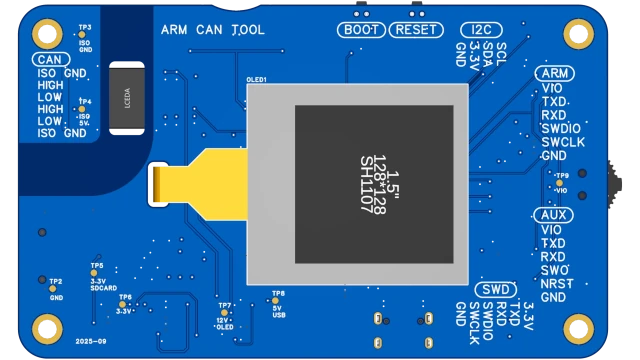](doc/pictures/3D_PCB1_front.webp)

[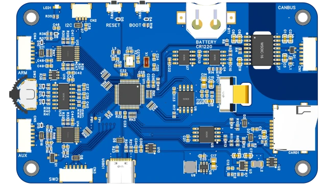](doc/pictures/3D_PCB1_back.webp)

To see a 3D model of the board:

- open the project in EasyEDA Pro.
- open the pcb "PCB1".
- click "3D" in the menu bar. This shows the board in the 3D shell.
- click "Layers"
- click the eye icon labelled "3D Shell". The 3D Shell disappears, and the board itself is shown.

## CAN Bus Isolation

For reference in accordance with IEC 60664-1 and GB/T 16935.1, the following data was used for insulation calculations:

| component   | CTI     | clearance | creepage |
| ----------- | ------- | --------- | -------- |
| CA-IS2062VW | >= 600V | 8 mm      | 8 mm     |
| FR4 PCB     | >= 175V | 8 mm      | 9 mm     |

The arm can tool design uses standard FR4, making it unsuitable for certified high-voltage applications as-is.

However, the core isolated CAN bus interface is available as a dedicated [separate board](https://oshwlab.com/koendv/canbus_module).
With this separate CAN bus board as a foundation, and using high-CTI FR4 (available from assemblers like pcbway), board cleaning and conformal coating, it might be possible to build a design that could be certified. But that merits a project on its own.

This open-source design is provided under CC0, so anyone is free to use, modify, and commercialize a certified version.

Disclaimer: This information is provided for reference only and without any warranty. The design is not certified for safety or regulatory compliance. Users are responsible for ensuring their own designs meet applicable standards and regulations.

## Hardware Extension

The easiest way to add hardware is using the I2C connector.

Room and spare pins for additional hardware:

- between usb connector and switching power supply there is room for a battery charger ic.
- pin PB1 is free, to be used as the CS of a new SPI device.
- if more pins are needed, free up pin PC0 and PC1 by connecting the I2C connector to pin PB6 and PB7.

## EMI Considerations

A very hands-on approach to electro-magnetic interference (EMI).

The QSPI flash is used for program storage and runs at 108 MHz. 108 MHz is the highest frequency of the FM radio band.

Take an FM radio, tune to 108 MHz or slightly below. Put the antenna on the component side of the board, 1 to 2 cm above the traces between processor and QSPI flash. When the "arm can tool" is connected to usb, a local radio station near 108 Mhz is replaced with a shrill noise.

The effect decreases rapidly with distance. At 10-30 cm distance there is already no interference. In most cases, EMI will not be a problem.

If shielding is necessary, three options.

- cover the inside of the component side of the case with copper foil 3M 1181 or equivalent. 3M 1181 is 0.066mm copper foil tape with conductive adhesive. The conductive adhesive permits strips of tape to overlap.
- paint the inside of the component side of the case with conductive spray ([Kontakt Chemie EMI 35](https://kontaktchemie.com/KOC/KOCproductdetailV2.csp?product=EMI%2035), [MG Chemicals 842AR](https://mgchemicals.com/products/conductive-paint/conductive-acrylic-paints/silver-conductive-paint/))
- add EMI shielding clips (e.g. C238199 [ICSRC6508SFR](https://jlcpcb.com/partdetail/ModaInnochips-ICSRC6508SFR/C238199)) to the board, to attach EMI shield cans.

Note:

- To work, the shielding has to make contact with pcb ground.
- The pcb has four screw mounting pads. Three are VCC ground, one is canbus ground. ⚠️ The shielding should not short-circuit canbus ground and VCC ground.

A practical, low-cost approach:

At 100 MHz, the wavelength is approximately 3 m, so a 5 mm aperture in the shielding has negligible effect. The implemented shielding consists of 0.06 mm thick adhesive copper foil, positioned 5 mm above the PCB ground plane. A Kapton sheet is used as an insulating layer to prevent short circuits with underlying components.

This configuration has been verified to provide sufficient shielding performance at 108 MHz.

Note: The addition of the shielding reduces the isolation clearance to 5 mm.

|[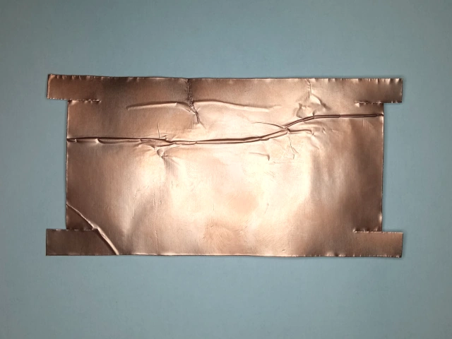](doc/pictures/shielding_copper.webp)|[](doc/pictures/shielding_kapton.webp)|[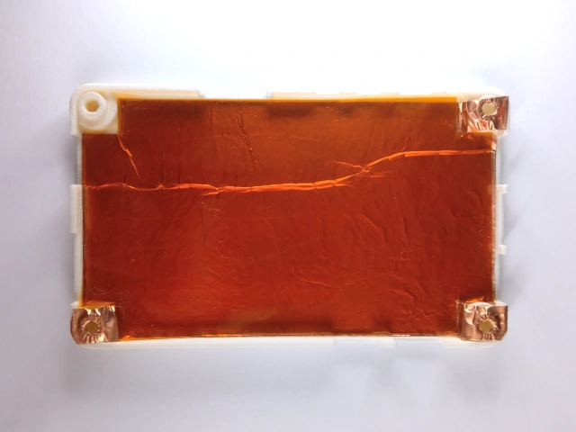](doc/pictures/shielding_mounted.webp)|
|---|---|---|
|copper|kapton|shielding|

In most cases, EMI shielding may not be required. However, this design can serve as a reference or starting point for applications where additional EMI protection is judged necessary.

## Menu System

| | | |
|---|---|---|
|  | | |
| |  | |
| |  | |
| |  | |
| | |  |
| |  | |
| |  | |
| |  | |
| | |  |
| | 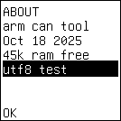 | |
| | |  |

## References

- [AT32F405](https://www.arterychip.com/en/product/AT32F405.jsp#Resource) datasheet and reference manual (English)
- The [Black Magic Probe book](https://github.com/compuphase/Black-Magic-Probe-Book/releases/latest/download/BlackMagicProbe.pdf) covers setting up and using the Black Magic Probe.
- [pyOCD](https://github.com/mbedmicro/pyOCD)
- [probe-rs](https://probe.rs/) for rust

## Software Components

The software consists of:

- [rt-thread](https://github.com/RT-Thread/rt-thread) operating system
- [u8g2](https://github.com/olikraus/u8g2) graphics, with [mui](https://github.com/olikraus/u8g2/wiki/muimanual#introduction) menu system
- [black magic debug](https://github.com/blackmagic-debug/blackmagic) gdb server
- [free-dap](https://github.com/ataradov/free-dap) cmsis-dap server
- [cherry dap](https://github.com/cherry-embedded/CherryDAP) usb stack
- [lua](https://github.com/lua/lua) programming language

I would like to extend my thanks to the authors and contributors of all this fine software.

# License

This project (including all software, hardware designs, documentation, and other creative content) is dedicated to the public domain under the Creative Commons Zero ([CC0](https://creativecommons.org/publicdomain/zero/1.0/)) 1.0 Universal Public Domain Dedication.

## What this means

- Use this project for **any purpose**, personal or commercial
- Modify, adapt, and build upon the work
- Distribute your modifications **without any requirements** to:
  - Provide attribution
  - Share your changes
  - Use the same license
- No permission is needed - **just use it!**

## No Warranty

This project is provided **"as is"** without any warranties. The authors accept no liability for any damages resulting from its use.

