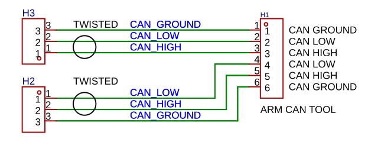
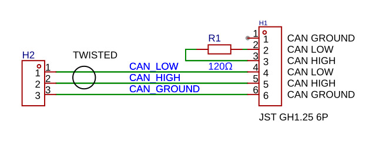

# ARM CAN TOOL — CAN Bus

CAN 2.0A/B interface, electrically isolated. Maximum bus speed: 1 Mbit/s.

⚠️ **Warning - isolation is functional, not protective.**

The isolation barrier separates the CAN bus ground from the probe/PC ground for signal integrity and ground-loop avoidance. It is not a certified safety barrier and must not be the only thing standing between the user/PC and a hazardous voltage.

It's appropriate for sniffing the CAN bus of a model railway; not the CAN bus of a real electric locomotive.

See [isolation](HARDWARE.md#can-bus-isolation) for isolation specifications and environmental limitations.

Device is not safety certified. User is responsible for compliance with applicable standards.

## CAN Bus and Operating Mode

CAN bus availability and USB appearance depend on operating mode:

| Mode | CAN Bus Active | USB Appearance |
| --- | --- | --- |
| GDB Server | Yes | gs_usb / SocketCAN |
| CMSIS-DAP | Yes | USB serial (SLCAN) |
| Lua Script | Yes | None — available to Lua scripts only |
| Mass storage | No | SD card as USB mass storage |

## Connect CAN Bus



CAN bus connector has six pins: CAN ground, CAN_HIGH, and CAN_LOW to previous node; CAN ground, CAN_HIGH, and CAN_LOW to next node.



No internal terminating resistors. If ARM CAN Tool is the last device on the bus: connect 120 Ω across CAN_HIGH and CAN_LOW. If using JST GH1.25 to DuPont 2.54 cables: two male Dupont 2.54 pins with a 120 Ω resistor.

Verification: With no power, and two 120 Ω terminations present on the bus, resistance between CAN_HIGH and CAN_LOW measures approximately 60 Ω.

### CAN Bus Settings

| Setting | Description |
| --- | --- |
| CANbus → speed | Set CAN bus speed |
| CANbus → canfilter | If set: apply CAN bus filter from saved settings. If not set: pass all packets |
| Startup → CANbus | If set: start CAN bus at boot. If not set: start CAN bus when USB connects |
| CANbus → logging | If set: log SocketCAN packets on target console |
| Startup → logging | If set: log target console to SD card |

### CAN Bus Startup

At boot, in sequence:

1. Apply speed setting from CANbus → speed.
2. If CANbus → canfilter is set: apply CAN bus filter from saved settings. If not set: pass all packets.
3. If Startup → CANbus is set: start CAN bus at boot. If not set:
   - GDB Server mode, CMSIS-DAP mode: start CAN bus when USB configures.
   - Script mode: start after `can.init(true)`.
4. In GDB Server mode, if CANbus → logging is set: log SocketCAN packets on target console.
5. If Startup → logging is set: log target console to SD card.

## Initialize gs_usb

In GDB Server mode, CAN bus appears as a gs_usb / SocketCAN device.

If logging is enabled in the CAN bus menu: device logs all incoming CAN bus packets passing the filter on the target console in candump format.
Timestamps are seconds since boot.

If logging is also enabled in the Startup menu: target console logs to SD card. See LOGGING.md.

### Initialize Linux gs_usb Device

Prerequisites: `can-utils` installed.

```
$ apt-get install can-utils
```

1. Load kernel module.

   ```
   $ sudo modprobe gs_usb
   $ dmesg
   [21374.570428] CAN device driver interface
   [21374.576337] usbcore: registered new interface driver gs_usb
   ```

   Verification: `dmesg` shows `registered new interface driver gs_usb`.

2. Register ARM CAN Tool USB ID with driver.

   ```
   $ echo 1209 8816 | sudo tee /sys/bus/usb/drivers/gs_usb/new_id
   $ dmesg
   [21650.436075] gs_usb 3-1:1.0: Configuring for 1 interfaces
   ```

   `1209:8816` is the USB VID:PID of ARM CAN Tool.

   Verification: `dmesg` shows `gs_usb` configuring for 1 interfaces.

3. Bring up CAN interface at target bus speed.

   ```
   $ sudo ip link set can0 up type can bitrate 500000
   ```

   Verification: `ip link show can0` shows interface as UP.


### Common Commands

Inspect interface:

```
$ ip link show can0
```

Send a frame:

```
$ cansend can0 123#deadbeef
```

Receive frames:

```
$ candump can0
```

## Initialize SLCAN

In CMSIS-DAP mode, CAN bus appears as a USB serial port running SLCAN protocol.

If Linux udev rules are installed:

```
$ slcand -o -c -S 500000 /dev/ttyBmpSlcan
```

Verification: Serial port `/dev/ttyBmpSlcan` opens without error.

Send and receive commands: see Common Commands above.

## Configure canfilter

Download and install [canfilter](https://github.com/koendv/canfilter) to configure CAN bus packet filtering by ID from the host PC.

### canfilter Options

```
$ canfilter [options] [IDs and ranges]
```

**IDs:** single CAN IDs — `0x100`, `256`, `0x1000`

**Ranges:** CAN ID ranges — `0x100-0x1FF`, `256-511`, `0x1000-0x1FFF`

| Option | Long Form | Description |
| --- | --- | --- |
| `-o MODE` | `--output MODE` | Set output mode: `auto`, `bxcan_f0`, `bxcan_f4`, `fdcan_g0`, `fdcan_h7` |
| `-a` | `--allow-all` | Allow all packets |
| `-v` | `--verbose` | Enable verbose output (repeat up to three times) |
| `-u VID:PID[@SERIAL]` | `--usb VID:PID[@SERIAL]` | USB vendor ID, product ID, and optional serial number |
| `-h` | `--help` | Show help |

Mode `auto` (default) and `bxcan_f0` are both correct for ARM CAN Tool.

- Single ID treated as standard if ≤ `0x7FF`; extended if ≤ `0x1FFFFFFF`.
- Range treated as extended if either bound is an extended ID.
- Hex values require `0x` prefix.

### canfilter Examples

Allow single standard ID:

```
$ canfilter -u 1209:8816 0x100
```

Program standard ID range:

```
$ canfilter -u 1209:8816 0x100-0x1FF
```

Program mixed standard and extended IDs with verbose output:

```
$ canfilter -u 1209:8816 0x100 0x200-0x2FF 0x1000 -v
```

Print bxCAN registers without programming hardware:

```
$ canfilter -o bxcan_f0 -d -v -v -v 0x1000-0x1fff
```

⚠️ **Warning: canfilter detaches gs_usb driver.**

**Consequence:** The `can0` interface goes down, because canfilter detaches ARM CAN Tool from the kernel gs_usb driver to send the filter to the device.

**Correct practice:** Re-initialize `can0` after running canfilter:

```
$ sudo ip link set can0 up type can bitrate 500000
```

Verification: `ip link show can0` shows interface as UP.

### canfilter Shell Command

canfilter is available as an rt-thread shell command.

```
msh />canfilter 0x100 0x200-0x2FF
Filter usage: 2/14 (14%)
msh />canfilter -v 0x100 0x200-0x2FF
bxcan std list id 0x100
bxcan std mask id 0x200 mask 0x700
Filter usage: 2/14 (14%)
canfilter: filter programmed successfully
msh />
```

Shell command applies filter directly to hardware and takes effect immediately. Shell command works in all operating modes, including SLCAN. `canfilter -u` and `-o` options are not available in shell.

Verification: Shell reports `canfilter: filter programmed successfully`.

The `canfilter` PC program configures CAN bus filters only when the CAN bus interface is gsusb/socketcan. 
The `canfilter` rt-thread shell command configures CAN bus filters when the rt-thread CAN bus device is up.
Saving settings also saves the CAN bus filter.
If canfilter is enabled in the CAN bus menu: saved filter is applied at boot for all modes where CAN bus is active: gdb server, cmsis-dap and Lua script.

