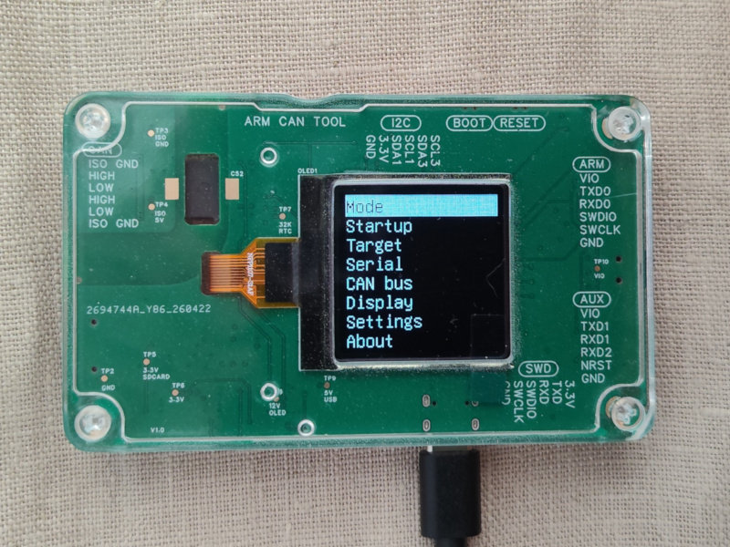
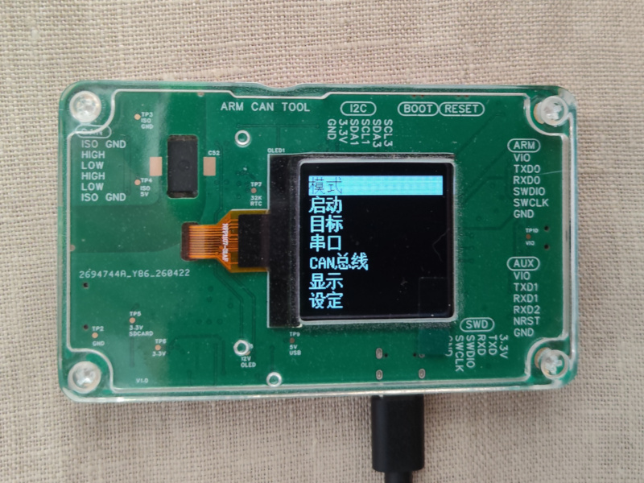
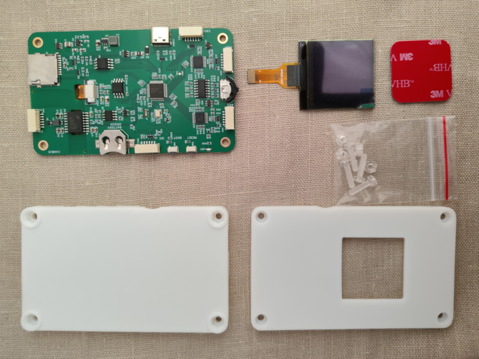

# ARM CAN TOOL — Commercial Information

**Hardware revision:** v1.0

---

## Product Summary

|||
|---|---|
|English|简体中文|

ARM CAN Tool is a debug probe for ARM and RISC-V embedded systems. Combines SWD/JTAG debugging with electrically isolated CAN 2.0 interface. Targets firmware developers working with STM32 and other embedded processors on CAN bus systems — see [TARGETS](TARGETS.md) for the full list.

- Combines isolated CAN bus monitoring with full debug probe in one device.
- Hardware design is CC0. No IP risk on hardware. No upstream licensor for hardware.
- Ship bootloader preloaded (MIT, permissive). Do not ship firmware preloaded (GPLv3, license obligation).
- Firmware updates via USB mass storage. No tools required. Reduces support burden.
- OLED display with menu. No host software required to configure device.
- Supports unattended remote deployment.
- Manufactured via JLCPCB and standard Chinese supply chain.

---

## Unit Cost

Costs based on orders placed in 2025. Excludes shipping and taxes.

| Item | Qty 2 (USD) | Qty 5 (USD) |
| ---- | ----------- | ----------- |
| PCB assembly (board only) | 57.50 | 30.60 |
| Processor (AT32F405) | 1.75 | 1.75 |
| OLED display | 3.50 | 3.50 |
| Enclosure (3D printed) | 4.50 | 4.50 |
| 3M VHB sticker | 0.10 | 0.10 |
| Screws and nuts | 0.10 | 0.10 |
| **Total per unit** | **67.45** | **40.55** |

PCB assembly cost as of 07/2025: USD 115 for 2 units, USD 153 for 5 units. JLCPCB Economy assembly. Excludes shipping and tax.

At quantity 5, unit cost is approximately USD 40 (2025).

---

## Supply Chain

⚠️ **Warning — single-source components:** Processor (AT32F405) and OLED display have single sources. Monitor availability before committing to production run.

See MANUFACTURING for component sourcing details.

---

## License

Hardware design is CC0. Manufacture, modify, and sell without restriction.

Bootloader is MIT, permissive. Preload bootloader.

Firmware includes GPLv3 components. Do not preload firmware - shipping firmware preloaded triggers license obligations. See [LICENSE.md](LICENSE.md) for details.

---

## Reseller Procedure

1. Order assembled PCBs from JLCPCB.
2. Order OLED displays separately. OLED is not included in PCB assembly order.
3. Order 3D printed enclosures from JLC3DP.
4. Preload bootloader. Doubles as production test - verifies power supply, USB, MCU.
5. Pack PCB, OLED, enclosure, 3M sticker, screws and nuts.
6. Ship.

Verification: All components present in package before shipping.

Buyer assembles device. Customer installs firmware.

---
