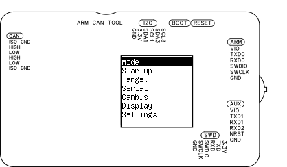
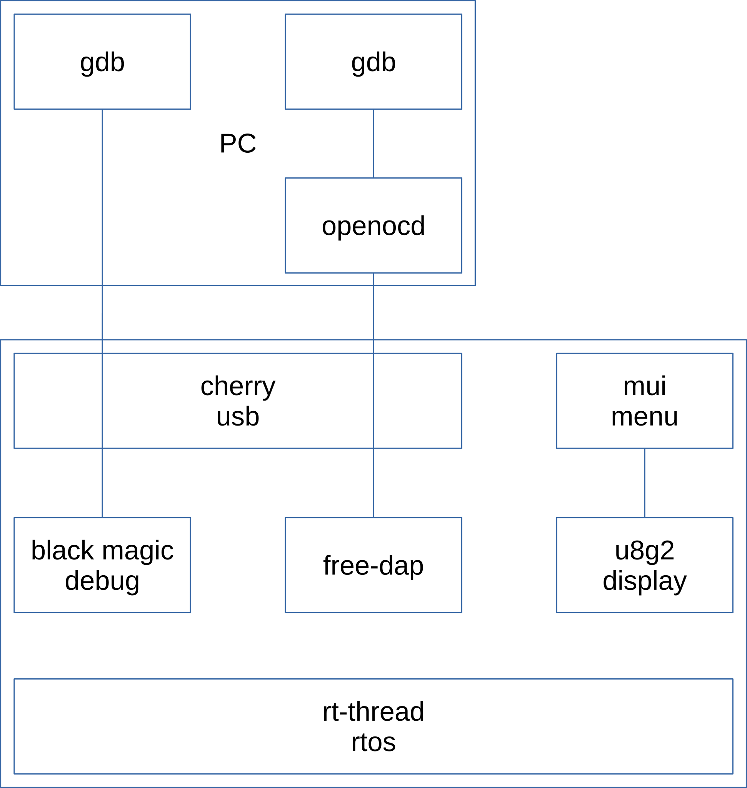
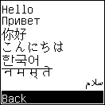

# ARM CAN TOOL — Developer Guide

> Correctness takes precedence over architectural purity.



## Prerequisites

**Knowledge:**

- Embedded systems firmware development
- ARM Cortex-M architecture
- rt-thread or equivalent RTOS
- Linux command line

**Tools:**

- Docker
- Git

---

## Building from Source

[`tools/docker/Dockerfile`](../tools/docker/Dockerfile) is the single source of truth for building from source. The Dockerfile states toolchain, rt-thread and rt-thread package versions.

Github actions runs the same Dockerfile in CI.

On a host that matches the linux used in the Dockerfile, the commands can be run directly instead of inside a container.

To build:

```bash
docker build --target build -t arm_can_tool -f tools/docker/Dockerfile .
id=$(docker create arm_can_tool)
docker cp "$id":/output ./arm_can_tool_firmware
docker rm "$id"
```


In `./arm_can_tool_firmware/`:

- `cherryuf2_arm_can_tool.bin`, `cherryuf2_arm_can_tool.elf`: bootloader
- `rtthread.uf2`, `rtthread.elf`: firmware
- `arm_can_tool.epub`: manual
- `MANIFEST.txt` — URL and commit of every git repository used in the build

If, after modifying a menu, an UTF8 character does not display, run:
```
./tools/update_unifont.sh
```
and recompile. `update_unifont.sh` ensures the font contains all characters used.

**Verification:** all characters display correctly.

### Flashing


**Manual:** Enter UF2 bootloader mode (hold multi-direction switch and press [RESET]), then copy:

```bash
cp rtthread.uf2 /media/$USER/CherryUF2/CURRENT.UF2
```

**Automated:** With the board already in UF2 bootloader mode:

```bash
scons --flash
```

Expected output:

```
flash_action(["flash"], ["rtthread.uf2"])
Flashed rtthread.uf2 -> /media/koen/CherryUF2/CURRENT.UF2
scons: done building targets.
```

`scons --flash` compiles if needed, then copies `rtthread.uf2` to the `CherryUF2` mount point. The board must be in UF2 bootloader mode before running this command.

---

## devcontainer

An alternative to a native Linux install: build once, then bind-mount the source tree into the container for every edit-compile cycle. Runs as a non-root user matching the host UID/GID, so files created in the mounted tree stay owned by the host user.

### docker build

Once:

```bash
docker build --target tools -t arm_can_tool-tools \
  --build-arg USER_UID=$(id -u) --build-arg USER_GID=$(id -g) \
  -f tools/docker/Dockerfile .
```

### docker run

For every session:

```bash
docker run -it --rm \
  -v /home/koen/src/rt-thread:/work/rt-thread \
  -e RTT_ROOT=/work/rt-thread \
  -w /work/rt-thread/bsp/at32/arm_can_tool \
  arm_can_tool-tools bash
```

Then `scons` inside. Build output lands directly in the mounted source tree on the host — no `docker cp` needed. `exit` to end the session; the container is removed (`--rm`), the host tree is untouched.

---

## Firmware Installation

For complete firmware installation and recovery procedures, see [INSTALL](INSTALL.md).

### Bootloader Console Output

The bootloader prints one of two messages on the console (115200 baud) at boot.

| Output | Meaning |
| ------ | ------- |
| `app` | Multi-direction switch not pressed. Bootloader starts the application. |
| `dfu` | Multi-direction switch pressed. Bootloader waits for a UF2 file. |

### RAM Size

The AT32F405 has 102 kB RAM when the RAM parity check option bit is disabled (factory default). If RAM parity check is enabled, available RAM is 96 kB. The firmware is compiled for 102 kB. If the bootloader prints `96k ram`, reset the processor option bits to restore factory defaults.

### Recovery — Mass Erase

If internal flash is corrupted, reinstall the bootloader with a full mass erase:

```bash
sudo dfu-util -a 0 -d 2e3c:df11 \
              --dfuse-address 0x08000000::mass-erase:force \
              -D cherryuf2_arm_can_tool.bin
```

---

## Software Architecture

> Build one layer on top of existing, known-good software. Focus on improvements and useful new features.



*Software block diagram.*

The firmware integrates two independent debug probe implementations alongside CAN bus, UI, logging, and scripting subsystems, all running under rt-thread.

### Debug Interfaces

| Component | Role | Host connection |
| --------- | ---- | --------------- |
| [Black Magic Debug](https://github.com/blackmagic-debug/blackmagic) | GDB server | GDB connects directly |
| [free-dap](https://github.com/ataradov/free-dap) | CMSIS-DAP v2 | GDB connects via OpenOCD, pyOCD, or probe-rs |

The two debug interfaces are mutually exclusive at runtime. Mode selection determines which is active.

### Software Components

| Component | Role |
| --------- | ---- |
| [rt-thread](https://github.com/RT-Thread/rt-thread) | Real-time operating system |
| [Black Magic Debug](https://github.com/blackmagic-debug/blackmagic) | GDB server |
| [free-dap](https://github.com/ataradov/free-dap) | CMSIS-DAP implementation |
| [CherryUSB](https://github.com/cherry-embedded/CherryUSB) | USB protocol stack |
| [u8g2](https://github.com/olikraus/u8g2) / [MUI](https://github.com/olikraus/u8g2/wiki/muimanual) | Display graphics and menu system |
| [Lua 5.5](https://github.com/lua/lua) | Scripting language |

### Code Formatting

Code in the `applications` directory and its subdirectories is formatted with `clang-format -i`. Code outside `applications` is from third-party projects — leave as is.

### AT32 Workbench

[AT32 Workbench](https://arterytek.com/en/support/tools.jsp) is a graphical tool from Artery (雅特力) for configuring clocks, pins, and peripherals and generating hardware initialisation source code.

The ARM CAN Tool hardware configuration is saved in `arm_can_tool_WorkBench.ATWP`.

**Procedure:**

1. Launch AT32 Workbench.
2. Select `Project → Open Project`.
3. Navigate to `AT32_Work_Bench/` and select `arm_can_tool_WorkBench.ATWP`.
4. Click `Open`.

Verification: The Workbench window displays the AT32F405 pinout with peripheral assignments and a clock tree showing 216 MHz.

Selecting `Project → Generate Code` produces initialisation code in `AT32_Work_Bench/project/`:

- `at32f402_405_int.c` — interrupt vector table
- `at32f402_405_wk_config.c` — clock configuration
- `wk_*.c` — peripheral initialisation

These generated files are integrated into the BSP at `arm_can_tool/board/src/`.

### USB Stack

[CherryUSB](https://github.com/cherry-embedded/CherryUSB) manages the USB endpoints. The USB configuration is mode-dependent and is reconfigured at each boot.

The DWC2-AT USB controller uses a static FIFO configuration. CDC0 and CDC1 have asymmetric TX FIFO allocations reflecting their different traffic patterns.

| Endpoint | TX FIFO | Assignment | Rationale |
| -------- | ------- | ---------- | --------- |
| EP0 | 64 bytes | Control | Standard control endpoint |
| EP1 | 512 bytes | GS-USB IN, MSC IN | Bulk transfer |
| EP2 | 1024 bytes | CDC0 IN (log output) | Continuous streaming: RTT, SWO, serial console, memwatch |
| EP3 | 512 bytes | CDC1 IN (GDB / CMSIS-DAP) | Response traffic only. Firmware download travels USB OUT through shared RX FIFO. |
| RX (shared) | 1024 bytes | All OUT endpoints | Shared receive FIFO |

CDC0 TX FIFO size is twice CDC1 TX FIFO size, for CDC0 to absorb bursts of continuous log output without stalling.

Within the application, CDC0 and CDC1 are treated differently:

- CDC1 feeds characters from PC to the gdb server. CDC1 is a rt-thread character device.
- CDC0 writes logs and target output to PC. CDC0 is double-buffered for throughput.

### Event-Driven Design

The firmware is designed around one rule: threads must not busy-wait. When a thread has nothing to do, it must sleep. The system LED enforces this discipline — a continuously lit LED indicates a thread is busy-waiting.

All modes have a thread that blocks on `rt_event_recv()` and wakes only when an event occurs or a timeout expires.

Three justified exceptions exist.

**Exception 1 — Target state polling.** SWD provides no interrupt from target to probe. The GDB server polls the target over SWD to detect breakpoints, traps, and faults. This is implemented as a timeout on `rt_event_recv()` rather than a busy loop. The polling interval is configurable via **Target → polling ms**.

**Exception 2 — Target flash write sequences.** Flash write drivers poll target registers and insert delays. These sequences are processor-family-specific, inherited from upstream Black Magic Debug, and have not been rewritten to be event-driven. Correctness takes precedence over architectural purity.

**Exception 3 — SWO buffer flush.** SWO interrupts when the uart buffer is half full or full. When the gdb server polls the target, the gdb server also checks for undecoded SWO data. The idle-timeout check avoids data, smaller than half the dma buffer, staying undecoded e.g. when the target halts.

Outside these three exceptions, the firmware contains no polling loops.

### UI

[u8g2](https://github.com/olikraus/u8g2/wiki) provides the graphics layer. [MUI](https://github.com/olikraus/u8g2/wiki/muimanual) provides the menu system. The display is updated only when content changes. The multi-direction switch is debounced in hardware and software and generates one interrupt per press — no polling required.

---

## GPIO and Bit-Banging

GPIO bit-banging uses:

- direct GPIO register access
- all SWD/JTAG pins updated in one write
- firmware executing from zero-wait-state RAM
- interrupts disabled

### Zero-Wait-State RAM Execution

The hot SWD and JTAG bit-banging routines are copied to RAM at boot and executed from RAM. Execution from RAM has no wait states.

From [boot log](REFERENCE.md#boot-log):

```
I/SWD: ramfunc 3700 byte
```

### Port A Pin Assignment

| Pin | JTAG function | JTAG dir | SWD function | SWD dir |
| --- | ------------- | -------- | ------------ | ------- |
| PA0 | TDI_DIR | OUT | TXD_DIR | OUT |
| PA1 | TDO_DIR | OUT | RXD_DIR | OUT |
| PA2 | TDI | OUT | TXD | OUT |
| PA3 | TDO | IN | RXD | IN |
| PA4 | TMS | OUT | SWDIO | IN/OUT |
| PA5 | TCK | OUT | SWCLK | OUT |
| PA6 | TMS_DIR | OUT | SWDIO_DIR | OUT |
| PA7 | TCK_DIR | OUT | SWCLK_DIR | OUT |

One GPIO register write updates all 8 pins.

This pinout also allows SWD/JTAG bit-banging using timer-triggered DMA to GPIO ([ST AN4666](https://www.st.com/resource/en/application_note/an4666-parallel-synchronous-transmission-using-gpio-and-dma-stmicroelectronics.pdf), [Artery AN0103](https://www.arterytek.com/download/APNOTE/AN0103_AT32F435_437_DMA_Application_Note_EN_V2.0.1.pdf)).

---

## Flash Write Performance

Both debug interfaces run on the same hardware with the same GPIO optimisations, allowing direct performance comparison. Measurements use MicroPython firmware as the test payload (large binary, widely available). Programming time includes erase and write phases. Speed as reported by `arm-none-eabi-gdb`. Speed set using `mon freq 10000000` / `mon adapter speed 10000`.

**STM32F412:**

| kB/s | SWD | JTAG |
| ---- | --- | ---- |
| Black Magic Debug | 16 | 15 |
| OpenOCD / free-dap | 16 | 10 |

These speeds are target-family dependent. The Black Magic Debug GDB server was originally designed for USB Full Speed (12 Mbit/s) on a 72 MHz processor. On USB High Speed (480 Mbit/s), the character-at-a-time USB polling model (`gdb_if_getchar()`) is a bottleneck. The arm_can_tool firmware has been rewritten to use an event-driven model based on `rt_event_recv()`, which reduces CPU load significantly. Further optimisation opportunities remain.

### UF2 Bootloader Write Speed

The UF2 bootloader programs the application firmware into QSPI flash at over 65 kB/s. No further optimisation planned.

---

## Single Wire Output

SWO uses AT32 HAL.
uart7 writes to a circular RX buffer (SWO_DMA_BUFSIZE, 2k), interrupts when half full or full.
SWO then does zero-copy decoding directly from the DMA buffer.
SWO uart idle interrupts easily flood the system and are not configured.
To avoid data, smaller than half the buffer size, sitting undecoded in the buffer _forever_, the DMA pointer is read when the gdb event loop goes into idle timeout.

SWO decoding and bit-banged GPIO are the two subsystems where the rt-thread abstraction layer introduced unacceptable overhead, requiring direct hardware register or HAL access.

---

## DWT Trace

`swo_dwt_itm_decode.c` replaces `swo_itm_decode.c`: command-line compatible with the original `mon swo`, but adding `top` and `graph`.

`monitor dwt` (`cortexm_dwt()` in `cortexm.c`) configures target `DWT_CTRL` and `ITM_TCR` to generate DWT packets.

`monitor swo` (`swo_itm_decode()` in `swo_dwt_itm_decode.c`) decodes both ITM software packets and DWT hardware packets (PC sample, exception trace, data trace, local and global timestamp) from the SWO byte stream, using the DMA path described above.

Three output formats: `log`, `top` and `graph`.

- `log` outputs DWT trace to USB CDC as a text stream. The text is suitable for parsing using traditional unix tools (`grep -e "^PC:" dwt.log|sort|uniq -c|sort -rn|head`) or python scripts.

- `top` sorts the PC samples in up to 4096 buckets and outputs the top 25 periodically. (DWT_TOP_MAX_BUCKETS, DWT_TOP_N). Suitable for unattended capture of PC traces to SD card.

- `graph` outputs the same data as `top`, but formatted for ansi terminal. Suitable for seeing firmware status at a glance.

- the accepted tradeoff: no symbol resolution, hex addresses only.

ARMv7-M (M3/M4/M7) and ARMv8-M (M23/M33/...) define DWT trace as implementation-dependent. DWT is absent on ARMv6-M (Cortex-M0/M0+/M1).

`mon dwt status` prints an error message if DWT is absent.

For a full PC trace (ETM, Embedded Trace Macrocell), see [Orbuculum](https://github.com/orbcode/orbuculum).

---

## MTB Trace

`monitor mtb` (`cortexm_mtb()` in `cortexm_mtb.c`) reads the CoreSight Micro Trace Buffer. Reference: ARM DDI 0486B.

On attach, `adi.c` walks the Arm CoreSight ROM. If MTB is present, MTB base address is stored in `ap->mtb_base`. SRAM base is read from the MTB BASE register on first use and stored in `ap->mtb_sram`. `cortexm_mtb_fixup()` overrides `ap->mtb_base` and/or `ap->mtb_sram` for chips where the ROM table or BASE register is wrong (LPC84x).

`monitor mtb status` and `monitor mtb dump` only read. `mon mtb size` writes: stops tracing, writes all ones to register MTB POSITION to measure maximum buffer size (DDI 0486B, B.1), then restores POSITION and tracing. On restore failure, tracing is left off.

MTB could be extended to sample the trace buffer while the target is running, and provide a display of most active addresses, similar to "mon swo top".

---

## Semihosting

In gdb server mode semihosting calls are executed locally, on arm can tool.
Contrary to upstream, there is no [gdb file i/o](https://www.sourceware.org/gdb/current/onlinedocs/gdb.html/File_002dI_002fO-Remote-Protocol-Extension.html): no F-packets, no waiting on gdb.
Every syscall completes synchronously inside `semihosting_request()` and the target is resumed immediately.
All changes are confined to `semihosting.c`.

Semihosting file i/o maps to rt-thread's POSIX file layer.
The file descriptor table is global to the probe.
An ownership mask `semihosting_opened_fds` records which fds semihosting opened; target access to other fd is rejected.

The semihosting implementation limits itself to syscalls that can be executed immediately. SYS_READC returns -1 and SYS_READ on stdin returns EOF.

Semihosting logs to the console. If logging every syscall is needed, set `DBG_LVL` to `DBG_DBG` in `semihosting.c`.

**Verification** After changes to semihosting, run `tools/Arduino/SemihostingTest.ino`.

---

## Display and UI

The display subsystem consumes no CPU when display content does not change.

u8g2 was originally written for a 16 MHz 8-bit processor. On the 32-bit AT32F405 at 216 MHz, display update performance is not a constraint.


The display is square - a single menu layout for all four orientations (0°, 90°, 180°, 270°).

---

## Font System



All font processing — glyph selection, subsetting, RTL reordering — occurs at build time on the host PC. The MCU performs no font processing at runtime. The compiled firmware contains only the glyphs used.

In this text "glyph" means a Unicode code point. Limited to ASCII, "character" and "glyph" are the same.

### Updating the Font

After editing any menu source file and introducing new characters, regenerate `unifont.h`:

```bash
cd arm_can_tool
./tools/update_unifont.sh
```

### Manual Font Generation

The following documents what `update_unifont.sh` performs.

**Step 1 — Devanagari shaping.** `hbpp.py` reads `mui_form_*.c` and produces `mui_hb_strings.h` containing pre-shaped Devanagari strings.

```bash
tools/hbpp/hbpp.py font/unifont-17.0.04.otf 16 \
    applications/mui_form_en.c \
    applications/mui_hb_strings.h
```

**Step 2 — Arabic reshaping and bidi reordering.**

For right-to-left languages such as Arabic, `u8g2-rtl-strings.py` performs Arabic reshaping and bidi reordering at build time. No runtime processing is required.

`u8g2-rtl-strings.py` reads `mui_form_*.c` and produces `u8g2_rtl_strings.h` containing pre-shaped right-to-left strings.

```bash
tools/u8g2-rtl-strings/u8g2-rtl-strings.py \
    applications/mui_form_en.c > applications/u8g2_rtl_strings.h
```

**Step 3 — Concatenate source files.**

```bash
cat applications/mui_app.c \
    applications/mui_form_en.c \
    applications/mui_form_zh.c \
    applications/u8g2_rtl_strings.h \
    applications/mui_hb_strings.h > /tmp/all_utf8.c
```

**Step 4 — Build bdfconv.**

```bash
make -C packages/u8g2-official-latest/tools/font/bdfconv
```

**Step 5 — Generate font header.** `bdfconv` scans the concatenated file for all characters used, adds the full Latin alphabet (glyphs 32–127), and produces `unifont.h`.

```bash
packages/u8g2-official-latest/tools/font/bdfconv/bdfconv \
    -v -f 1 -m '32-127' \
    -u /tmp/all_utf8.c \
    -n u8g2_font_unifont \
    -o applications/unifont.h \
    font/unifont-17.0.04.bdf
```

### Font Files

An overview of the font files:

- `unifont-*.otf`: Font file, source of glyph metrics. Used in [harfbuzz](https://github.com/harfbuzz/harfbuzz) `hbpp.py` text rewriting and reshaping (Devanagari). Produces `mui_hb_strings.h`
- `unifont-*.bdf`: Font file, source of glyph bitmaps. Used in `bdfconv` to extract only the glyphs used in the menu sources. Produces `unifont.h`.
- `unifont.h`: C header with the bitmaps of all glyphs used in the menu system. Used in `u8g2_SetFont()`.

### TTF and OTF Fonts

Convert to BDF format first using `otf2bdf`:

```bash
otf2bdf -r 72 -p 32 'Font Awesome 6 Free-Solid-900.otf' > fontawesome.bdf
```

---

## Screenshot

The `printscreen` shell command outputs the current OLED display content as a PBM image over the console serial port. Used to capture menu screenshots for documentation.

**Procedure:**

1. Connect a terminal emulator to the SWD console port.
2. Navigate to the screen to capture.
3. At the `msh />` prompt, run `printscreen`.
4. Copy the PBM output into a text file `input.pbm`.
5. Convert to PNG:

```bash
convert input.pbm -rotate 90 \
        -bordercolor white -border 1 \
        -bordercolor black -border 1 \
        output.png
```

---

## Resource Usage

| Resource | Total | Used | % |
| -------- | ----- | ---- | - |
| RAM | 102 kB | 65 kB | 63% |
| Internal flash | 256 kB | 31 kB | 12% |
| External QSPI flash | 16 MB | 893 kB | 5% |

RAM is the most constrained resource.

---

## CAN Bus

The CAN bus interface does not use the rt-thread CAN bus device:

- CAN filters are written directly to bxcan filter registers. `canfilter_bxcan_f0.c` is a port to C of `canfilter_bxcan.cpp` from [koendv/canfilter](https://github.com/koendv/canfilter).
- Bit timing is set using HAL. `can_calc_bittiming.c` is a port of the Linux kernel's `can_calc_bittiming()` for bxcan at 108 MHz.
- `canbus_event.c` uses HAL drivers for CAN bus receive and transmit.

### CAN Bus Receive Hook

`bool can_rx_consumed(can_stored_frame_t *stored_frame);`

A weak function `can_rx_consumed()` is called for every CAN bus frame received. Override with a strong `can_rx_consumed()` to add higher-level CAN bus decoding, e.g. J1939.

Returns `true` if the frame was consumed by protocol decoder: frame is not delivered to slcan, gs_usb, or Lua.
Return  `false` if frame was not consumed by protocol decoder: frame is delivered as normal.

Use `cdc0_write()` to write protocol decoder output. Decoder output is written to usb cdc0, and to sdcard if `Startup->logging` is set.

## Lua Scripting Engine

### Design Principles

Two principles drive the Lua implementation.

**Event-driven execution.** Lua is implemented as an event-driven system: the Lua thread blocks on `rt_event_recv()` until an event fires, runs the registered handler briefly, then returns to sleep.

**Frugal RAM use.** Standard Lua libraries are stored in QSPI flash as read-only tables (rotables). User functions are stored as bytecode in internal flash and executed in place.

### Event Loop

The Lua event loop is in `script_engine.c`. The loop blocks on `rt_event_recv()` with three timeout modes:

| Condition | Timeout |
| --------- | ------- |
| No target running, no flash receive in progress | 1 second |
| Target running | Polling interval (configurable, default 50 ms) |
| `flash.receive()` active | 30 seconds — aborts on timeout |

On each wake, the loop polls RTT and memwatch if a target is running, dispatches `EVENT_TARGET_HALTED` if the target has just stopped, then calls registered Lua handlers for each pending event bit.

Incremental garbage collection is called after all event handlers have run, and the system is idle.
Running garbage collection after event handlers reduces the need to run garbage collection during an event handler.

Example — in Lua scripting mode, a CAN frame arriving while a receive-event handler is registered:

- CAN bus packet passes hardware filter and generates a CAN RX interrupt.
- CAN1_RX0_IRQHandler() stores the CAN bus packet in a ring buffer and sets EVENT_CAN1_RX0_INDIC. (canbus_event.c)
- lua_task() wakes up in rt_event_recv() (script_engine.c)
- run_event_handler() calls Lua event handler for EVENT_CAN1_RX0_INDIC (script_engine.c)
- can.receive() returns CAN bus packet from ring buffer or nil if ring buffer empty. Does not wait. (can_log.lua)
- sys.write() logs packet (can_log.lua)
- event handler returns when ring buffer drained (can_log.lua)
- lua_task() sleeps on rt_event_recv() (script_engine.c)

### Autoexec

At boot, if **Startup → lua autoexec** is enabled, `lfs_run_autoexec` executes the bytecode stored in flash sector 0. Typically the bytecode registers event handlers.

If sector 0 is empty or invalid, the error is logged and scripting mode continues without event handlers.

### Flash Transfer via lfs_send.py

`lfs_send.py` transfers pre-compiled bytecode to internal flash over CDC1 using an HDLC-framed protocol with CRC-32 verification. On the device side, use `flash.receive()`.

**Protocol summary:**

- One HDLC frame per 2 kB flash sector.
- Frame payload: version(1) + command(1) + sector(2) + data(2048) + CRC-32(4) = 2056 bytes.
- HDLC framing: `0x7E` flag, `0x7D` escape, escaped byte XOR `0x20`.
- Device responds ACK (`0x06`) or NAK (`0x15`) per frame.
- Continuation bit in command byte: set if more frames follow, clear on last frame.
- 30-second timeout per frame on the device side.

### Deviations from Standard Lua

#### `LUA_32BITS`

Lua integers and floats are 32-bit. This affects `math.maxinteger`, float precision, and `math.random`.

#### `LUA_NOCVTS2N`

Standard Lua implicitly coerces strings to numbers in arithmetic (e.g. `"10" + 5`). This is disabled. The string metatable and its heap allocation are eliminated entirely. Use `tonumber()` for explicit conversion.

#### Constants as Zero-Argument Functions

The rotable implementation cannot store string or float constants. Float and string constants are exposed as zero-argument functions.

#### String Method Syntax Not Available

The string metatable `__index` field is not set. `s:method()` syntax is not available.

```lua
-- Not available:
("hello"):upper()

-- Use instead:
string.upper("hello")
```

### Platform Configuration

Platform-specific settings are in `luaconf_platform.h`:

- Lua output (`print`, error messages) routes to CDC1.
- `require` searches `/sdcard/lua/` and `/flash/lua/` for modules.

### `LUAI_MAXCCALLS` and `LUAI_MAXSTACK`

The rt-thread c stack for the Lua task is limited to `LUA_STACK_SIZE` (8 kbyte).
`LUAI_MAXCCALLS` is lowered from Lua's default of 200 to 20 to bound worst-case *c stack* use.
Real event handlers nest little, so 20 leaves margin while still failing fast on runaway recursion.
Lua's own *value stack* is separate from the rt-thread c stack, and allocated from the Lua heap.
`LUAI_MAXSTACK`, the size of Lua's *value stack*, is derived from `LUAI_MAXCCALLS` to keep the two consistent.

### Memory Strategy: Rotable

All libraries are opened as rotables. A rotable wraps a `const rotable_Reg[]` array in flash as a Lua userdata. The heap cost is one pointer plus the userdata header — typically 8–12 bytes per library, regardless of how many functions it contains.

### Tab Completion

Tab completion is in `lua_completion.c`. The completion system operates on two levels: global names in `_G`, and members of a table or rotable one level deep using `.` or `:`.

### microrl

Lua shell uses the microrl command-line editing library.

Standard microrl splits a command line in c-style arguments (argc, argv). This is not used in arm can tool.

Microrl is patched to pass the raw command line instead.

## Porting

> Use rt-os where possible, HAL where needed, direct register access where unavoidable.

The firmware uses direct hardware access in four places:

- [JTAG/SWD bitbanging](#gpio-and-bit-banging)
- [SWO/ITM decode](#single-wire-output)
- [CAN filters and bit timing](#can-bus)
- [busy LED](#event-driven-design)

Ports assume USB HS, CAN FD.

Ports in order of difficulty:

- **rt-thread, STM32-like processor** — only CAN FD is new code.
- **rt-thread, RISCV** — HAL and direct hardware access differ. RISCV firmware is assumed 10-15% bigger than Arm Thumb-2. The current firmware image is [893 kB](#resource-usage); at 10-15% growth a RISCV rebuild lands at roughly 980 kB-1.03 MB, so 1 MB of flash leaves little to no safety margin. Proof of concept: [BMD gdb server for HPM5301](https://github.com/zhangjiance/bmp-hpm-port).
- **zephyr, STM32U595** — rt-os port maintained by ST. Rewrite of the whole ARM CAN Tool code base. Trades rt-os risk for porting risk.

The trodden path is narrow; it does not take much to be the only one who uses a feature.

---

## Known Issues

### CherryUSB Character Device Data Loss (stock rt-thread / CherryUSB)

Stock CherryUSB's rt-thread character-device glue (`rt_usbd_serial.c`) requests more incoming USB CDC data before confirming the receive buffer has room for a full packet. If the host sends data faster than the MCU drains the buffer the buffer overflows and data is silently lost. Symptom: flashing small binaries succeeds; flashing large binaries shows corruption.

Fixed by `patches/09-rt_usbd_serial.patch`: don't request more data until the receive buffer has 512 bytes free (USB HS). See [CherryUSB PR #408](https://github.com/cherry-embedded/CherryUSB/pull/408).

### SPI driver busy-waited

The rt-thread AT32 SPI driver used DMA for transfers but busy-waited until the DMA finished.
On ARM CAN Tool, this implied logging to file starved gdb server of cpu.
Fixed by `patches/14-dma.patch`: use `rt_completion()` to signal DMA completion, the same pattern as the rt-thread STM32 HAL SPI driver.

`drv_usart.c` and `drv_usart_v2.c` have the same busy-wait on DMA TX, not changed.

---

## Future Directions

### SPI Flash Firmware Partition

Black Magic Debug has a provision for storing target firmware images on external SPI flash. A partition of the 16 MB SPI flash could be allocated for this purpose.

### QSPI Flash Split Builds

Firmware uses less than 1 MB of the 16 MB QSPI flash (see [Resource Usage](#resource-usage)). QSPI flash could store different binaries, e.g. a custom patched firmware, or a Lua-only binary pruned for RAM usage.

### SD Card Log Management

`logger_rotate()` starts a new log file every `LOG_SIZE_MAX` (4 MB) bytes written. Avoid the SD card filling up and logging failing silently: after opening a new log, check free space with `statfs()`, and clear old logs when free space falls below a threshold.

### Log Compression

Log compression trades off CPU for SPI bandwidth and SD card space.

- Add a setting for run-time streaming compression of logs in the `logger` thread. Consider [heatshrink](https://github.com/atomicobject/heatshrink), and [tamp](https://github.com/BrianPugh/tamp). Use a compression algorithm with bounded RAM and CPU usage, all static, no `malloc()`/`free()`. Re-initialize compression at each `logger_rotate()`.
- Add msh command-line compression/decompression utilities, using on-stack buffers bounded by the finsh shell's own thread stack (`CONFIG_FINSH_THREAD_STACK_SIZE`, 2048 bytes).

### Semihosting Input

`SYS_READC` and `SYS_READ` on stdin currently always return -1 (EOF). Rough sketch to implement stdin:

- Add `CDC0_OUT_SEMIHOSTING` to send USB CDC0 to semihosting stdin.
- Add a small FIFO for incoming characters.
- If characters are queued, `SYS_READC` pops a character from the queue and returns immediately.
- If no characters are queued, a bool `in_syscall` is set. This is necessary because polling clears `DFSR`. While `in_syscall` is set, the target remains halted and `cortexm_halt_poll()` keeps returning `TARGET_HALT_RUNNING`, so `gdb_poll_target()` does not notify GDB.
- Incoming characters arrive via `EVENT_MASK_CDC0_RX` → `cdc0_receive()`. In `cdc0_receive()`, when `settings.cdc0_out == CDC0_OUT_SEMIHOSTING`, incoming characters are queued to the FIFO, a character is popped from the queue, written to the target, `in_syscall` cleared, and the target resumed.

`SYS_READ` unqueues up to the requested number of available characters; on an empty FIFO it uses the same in_syscall halt as SYS_READC, since returning 0 bytes filled would signal EOF to the target.

---

## Out of Scope

### GS-USB Interface Filter

The Linux `gs_usb` kernel module currently connects to any USB bulk interface without filtering by interface name. A filter accepting a module parameter specifying a required interface name string (e.g. `"GSUSB"`) would allow GS-USB and CMSIS-DAP bulk interfaces to coexist without ambiguity. This requires a Linux kernel patch.

This is why the firmware pairs CMSIS-DAP with SLCAN and Black Magic Debug with GS-USB, rather than offering CMSIS-DAP with GS-USB.

### High-Speed GS-USB

The GS-USB protocol transmits one CAN frame per USB packet. On USB High Speed (512-byte packets) this is suboptimal. Extending the protocol to carry multiple frames per packet would improve throughput and lower MCU load. This requires a Linux kernel patch to the `gs_usb` module.

### MicroPython

The ARM CAN Tool hardware can be re-used as a MicroPython platform by replacing one component: substitute the QSPI flash with an ESP-PSRAM64H QSPI PSRAM (64 Mbit) — a BOM change, no board revision required — partitioned as 2 MB execute-only firmware and 6 MB heap. The AT32 XIP PSRAM sample code is in `AT32F402_405_Firmware_Library/project/at_start_f405/examples/qspi/xip_port_read_write_sram`.

The porting effort has two parts:

- merge the AT32 PSRAM XIP sample into the UF2 bootloader (source at [github.com/koendv/at32f405-uf2boot](https://github.com/koendv/at32f405-uf2boot)) so the bootloader restores firmware from SPI flash to PSRAM at boot
- port MicroPython against the upstream MicroPython repository using the AT32F405 HAL directly, following the style of existing MicroPython ports.

This is outside the scope of the current project.

---

## Processor Probing


Black Magic Debug auto-detects the target processor; OpenOCD requires the developer to specify target processor.

Auto-detection trade-off: a probe sequence that correctly identifies the processors of one manufacturer can hang a processor from another manufacturer. Black Magic Debug avoids this by ordering probes carefully — works, but gets harder as more families are added. OpenOCD's explicit-model approach avoids the conflict but is prone to configuration errors.

**Possible improvement:** a menu to enable/disable probing per processor family, similar to Black Magic Debug's existing compile-time target selection (which exists for flash-size reasons, not probe conflicts). This would let users resolve probe conflicts without a firmware rebuild.

Complexity differs: in Black Magic Debug, a new target requires new probe firmware; in OpenOCD, a new target is only a PC-side change. ARM CAN Tool supports both. In standalone mode (no PC), only Black Magic Debug applies — making it the more relevant interface for this probe.

ARM CAN Tool supports all Black Magic Debug targets in a single firmware.

---

## Update Targets

Run after each Black Magic Debug update to regenerate the supported targets list in TARGETS.md.

1. Concatenate target source files:

```bash
more packages/blackmagic-latest/src/target/* > ~/Downloads/bmp_targets.txt
```

2. Upload `bmp_targets.txt` and `TARGETS.md` to an AI with the following prompt:

> You are an embedded processor expert. Attached TARGETS.md, a list of supported targets by a former version of Black Magic Debug, and bmp_targets.txt, current Black Magic Debug target source files. Update TARGETS.md. Flag removals explicitly. Note when support is partial or scaffolding only.

3. Review AI output. Confirm flagged removals and partial support notes.
4. Replace TARGETS.md with reviewed output.

CH32V003 and CH32V103/203/208/303/305/307 use a proprietary WCH debug protocol (RVSWD/SDI), not SWD or JTAG. [PR #2172](https://codeberg.org/blackmagic-debug/blackmagic/pulls/2172) requires more work before these targets can be added.

---

## Adding a New Target

Black Magic Debug recognises the following ARM architectures:

| Architecture | Variant |
| --- | --- |
| **Cortex-M** | M0, M0+, M3, M4, M7, M23, M33, M55, STAR-MC1 |
| **Cortex-A** | A5, A7, A8, A9, A15 |
| **Cortex-R** | R4 |

| Situation | Action |
| --------- | ------ |
| Target is a new ARM architecture | Define architecture in `adi.c` in `arm_component_lut[]`. Follow the existing pattern. Then proceed with steps 1–8 below. |
| Architecture is defined; `monitor targets` does not list the device | Proceed with steps 1–8 below. |
| Architecture is defined; `monitor targets` lists the device but `info mem` returns nothing | Flash and RAM regions are missing. Proceed from step 3. |

To add a new target:

1. Detect the device. Read `DBGMCU_IDCODE` or equivalent register at a known address. Return `false` if the ID does not match.
2. If the ID matches, set `target->driver` to a human-readable string.
3. Add RAM with `target_add_ram32()`.
4. Add flash with `target_add_flash()`. Supply erase and write functions. Check whether the flash erase and write functions are variants of stm32f1 or stm32f4.
5. Declare the probe function in `target_probe.h`.
6. Add a weak no-op stub in `target_probe.c`.
7. Register with `PROBE()` in the correct dispatch function: `cortexm.c`, `cortexar.c`, `riscv32.c`, or `jtag_devs.c`.
8. Add the source file to `meson.build`.

Verification — in `arm-none-eabi-gdb`:

- `monitor targets` lists the new device by the string set in `target->driver`.
- `info mem` lists flash and RAM address ranges.
- `load` writes firmware to flash.

If other targets of the same manufacturer and architecture exist: the flash controller interface and DBGMCU register address are shared. Use an existing target as the pattern.
