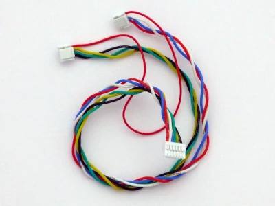
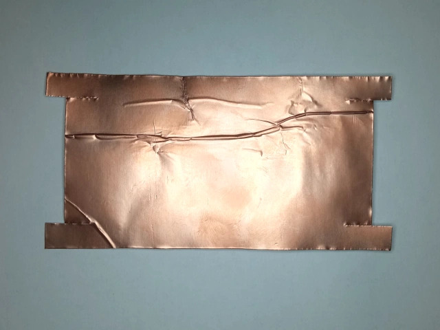
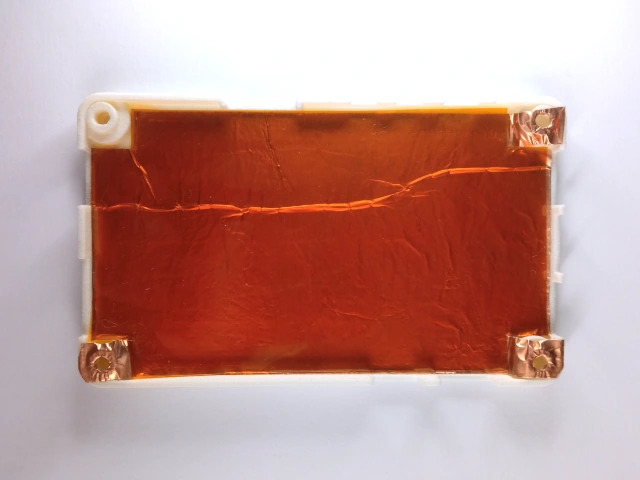

# ARM CAN TOOL — Hardware Reference

> Workflow is not: Given specifications, design hardware.

> Workflow is: Given product concept and manufacturing process, extract full performance.

> If the solution is complex, backtrack to when it was simple.

**Hardware Revision:** v1.0

**Intended Readers:** Electronics engineers evaluating the design, planning a board modification, or selecting components for production.

---

## Prerequisites

**Knowledge:**

- Basic electronics measurement (multimeter use)
- SMD soldering and rework
- I2C and SPI interfaces

**Equipment:**

- Multimeter
- USB-C cable
- Terminal emulator (Linux: minicom; Windows: PuTTY)
- Oscilloscope or frequency counter (crystal verification)

---

## Design Principles

### Hardware Policy

Hardware has to be right the first time. Software we can always update later.

### Second Source Components

Single-source components are a supply chain risk. Where possible, components have a second source.

| Component | Primary | Second Source |
| --------- | ------- | ------------- |
| AT32F405 MCU | Artery Technology | None ⚠️ |
| CA-IS2062VW CAN transceiver | Chipanalog | CA-IS3062VW (drop-in), NSIP9042V-DSWR (pin-compatible) |
| SH1107 128×128 OLED display | Zhongjingyuan (中景园) | None. Alternative requires connector and/or driver change. |

Monitor stock before committing to a production run.

### Economy Assembly

Design targets JLCPCB Economy PCBA throughout.

- All components are SMD. No through-hole parts, no headers, no press-fit connectors.
- Board leaves SMT assembly 100% soldered. Manual steps after assembly: attach OLED display (plug-in FPC), close enclosure.
- All connectors are JST GH 1.25 mm pitch, 6-pin.
- OLED uses a plug-in FPC connector. Reason: JLCPCB economy assembly does not include hot-bar soldering.
- All components are either stocked by JLCPCB, available for consignment or both.
- No conformal coating, no selective soldering, no unusual PCB finishes.
- PCB stackup JLC04161H-7628 (4-layer) is a standard JLCPCB offering. Standard stackup avoids surcharges and provides consistent impedance control across repeat orders.

### Simple Solutions Preferred

If a simple approach solves 90% of use cases, do not choose a complex approach to solve 95%.

### Accept Hardware Limitations

The cost and complexity of upgrading or supplementing a component are often underestimated. Accept the limitation instead, and extract full performance from what is fitted. Example: the AT32F405 supports CAN 2.0 but not CAN FD. Alternatives — a more capable MCU (STM32U595) or an external CAN FD controller (MCP2518FD) — increase cost or complexity. Instead, accept CAN 2.0 and use the controller to full capacity: use AT32 HAL instead of rt-thread, use hardware filtering instead of software filtering. No CPU load. Lean and cheap.

### PCB Layout

A well-routed board and a poorly-routed board cost the same to manufacture.

### Repairability

Component placement provides practical rework access — sufficient clearance to drag a soldering iron across the pins of every SOIC and LQFP package. The processor area accommodates an LQFP-64 10×10 mm body without moving other components, permitting a processor swap on a future board spin.

LQFP-64 package selection:

| Package | Assessment |
| ------- | ---------- |
| LQFP-48 | Insufficient pin count |
| LQFP-64 | Sufficient pins, hand-solderable, hand-reworkable |
| LQFP-100 and above | Excess pins, higher cost, reduced reworkability |

### Debug Interface

The debug interface supports up to four bidirectional pins, each with individual level translation and direction control. This accommodates SWD, JTAG, and manufacturer-proprietary debug protocols without hardware changes.

A SWD-only design could connect SPI MOSI and MISO directly to the target SWDIO. This was considered and rejected. Four GPIOs are used, with voltage translation and individual direction control, to permit programming of devices using proprietary protocols.

All four signal pins and their four direction control pins are on GPIO port A (PA0–PA7). A single register write updates all eight pins simultaneously. See [bit-banging](DEVELOPER.md#gpio-and-bit-banging).

---

## Design Files

| Resource | Location |
| -------- | -------- |
| Schematics and Gerbers | [Design files](https://github.com/koendv/arm_can_tool/tree/main/Hardware) |
| EasyEDA / OSHWLab project | [oshwlab.com/koendv/arm_can_tool](https://oshwlab.com/koendv/arm_can_tool) |

Designed using [EasyEDA Pro](https://pro.easyeda.com/). All design files published under CC0.

---

## Block Diagram


*System block diagram.*

The board contains two SPI flash chips. The 16 MB QSPI flash stores firmware and is executed in place (XIP) at 108 MHz. The 16 MB SPI flash stores data such as log files and Lua scripts. The QSPI flash is written by the bootloader. The SPI flash is managed by the rt-thread filesystem.

---

## Processor

The [AT32F405](https://www.arterychip.com/en/product/AT32F405.jsp) is an ARM Cortex-M4 microcontroller manufactured by Artery Technology (雅特力).

| Parameter | Value |
| --------- | ----- |
| Core | ARM Cortex-M4 |
| Clock | 216 MHz |
| RAM | 102 kB (parity check disabled) / 96 kB (parity check enabled) |
| Internal flash | 256 kB (6 wait states at 216 MHz; prefetch buffers enabled) |
| USB | High Speed (480 Mbit/s) and Full Speed, internal PHY |
| QSPI | Four-wire, up to 108 MHz |
| Package | LQFP-64, 7×7 mm body |

> The AT32F405 has 102 kB RAM when RAM parity check is disabled (the default). If the bootloader reports `96k ram`, the processor option bits require a reset.

### Processor Evaluation

The AT32F405 satisfies the combined ARM debug and CAN 2.0 probe use case: USB High-Speed with integrated PHY, Cortex-M4 at 216 MHz, and LQFP-64 package. CAN FD is not supported.

CAN FD support would require:

- Transceiver change to NSIP9042-DSWR
- Common mode choke change to ACT1210D-510-2P-TL00
- Processor with CAN FD capability

No current AT32 device offers both USB High-Speed and CAN FD. The AT32F456/F457 add CAN FD but revert to Full-Speed USB, making them unsuitable for this application. A pin-compatible AT32F405 variant with CAN FD would close this gap, but no such part currently exists.

### Processor Replacement

If the AT32F405 becomes unavailable or a CAN FD variant is required, the replacement must satisfy:

- USB High-Speed (not Full-Speed) with integrated PHY
- CAN FD
- LQFP-64 package preferred
- rt-thread BSP available (official or community)

Candidate devices include Nuvoton M3334SIGAE (community rt-thread BSP: [github.com/wosayttn/sdk-bsp-numaker-m3334ki](https://github.com/wosayttn/sdk-bsp-numaker-m3334ki)), STM32U595RJT6.

A PCB respin is required for a different processor. The current board layout has sufficient clearance around the processor footprint to accommodate an LQFP-64 10×10 mm body without moving other components. A 10×10 mm body increases pin pitch, which may permit HASL PCB finish in place of ENIG, reducing cost.

---

## Storage

| Device | Interface | Capacity | Purpose |
| ------ | --------- | -------- | ------- |
| W25Q128JVSIQ | QSPI, 108 MHz | 16 MB | Firmware storage, XIP execution |
| W25Q128JVSIQ | SPI | 16 MB | Filesystem (log files, scripts). May be partitioned for target firmware image storage. |
| SD card | SPI | User supplied | Removable log and script storage |
| 24C64 EEPROM | I2C | 64 kbit (8 kB) | Device settings |
| SD8931 | I2C | 70 bytes | Unused |

---

## Connectors and Pinouts

All connectors are JST GH 1.25 mm pitch, 6-pin.

For a quick-reference pinout table, see [REFERENCE.md](REFERENCE.md).

**ARM Connector**: Provides the debug interface to the target. In SWD mode, pins 2 and 3 carry serial0 (target console). In JTAG mode, pins 2 and 3 carry TDI and TDO.

⚠️ **Warning: serial0 and JTAG pin contention.**
In JTAG mode, the UART peripheral and the JTAG driver both attempt to drive pins 2 and 3 simultaneously. This causes electrical contention and possible damage. Disable serial0 before switching to JTAG mode: `Serial → Serial Enable → serial0 → Off`.

Pinout: see [REFERENCE.md](REFERENCE.md#arm-pinout).

**AUX Connector**: Provides serial1, serial2 (SWO), and the target reset signal.

Pinout: see [REFERENCE.md](REFERENCE.md#aux-pinout).

**SWD Connector (Probe Self-Debug)**: The debug interface of the AT32F405 itself — for debugging the probe firmware, not the target. Console: 115200 baud, 8N1.

Pinout: see [REFERENCE.md](REFERENCE.md#probe-swd-pinout).

**CAN Bus Connector**: Carries the isolated CAN signals. CAN_HIGH and CAN_LOW are duplicated on two pin pairs for daisy-chain wiring.

Pinout: see [REFERENCE.md](REFERENCE.md#can-bus-pinout).

> No internal terminating resistors. If the probe is the last device on the bus and termination is required, connect 120 Ω across CAN_HIGH and CAN_LOW at the connector.

### CAN Bus Adapter Cable

[](pictures/canbus_cable.jpg)

*CAN bus adapter cable.*

The CAN bus connector is 6-pin GH1.25. An adapter cable is required to connect to a standard 4-Pin GH1.25 CAN bus.

| Option | Notes |
| ------ | ----- |
| [LCSC custom cables](https://www.lcsc.com/customcables) | Suitable for production quantities. |
| AliExpress "GH1.25 Connectors and Pre-Crimped Silicone Cables" | Suitable for individual users. |

Wiring diagram: [canbus_cable.pdf](canbus_cable.pdf)

**I2C Connector.** May be used as two independent I2C buses, or as one I2C bus (I2C1) with two GPIO pins (PC0, PC1), e.g. as I2C ALERT and RESET inputs.

Pinout: see [REFERENCE.md](REFERENCE.md#i2c-pinout).

I2C1 is the internal bus, carrying the SD8931 RTC (0x68) and the 24C64 EEPROM (0x50). I2C1 is always active.

> **I2C1 caution:** External devices connected to I2C1 share the bus with the internal RTC and EEPROM. An address conflict or a device that stalls the bus will cause settings save and RTC operations to fail. Use I2C3 for external devices.

I2C3 is available for external devices. When I2C3 is not needed, PC0 and PC1 are available as general-purpose GPIO. PC1 (I2C3\_SDA) doubles as the external trigger input. When external trigger is enabled, I2C3 is not available. PC0 (I2C3\_SCL) is available as a general-purpose GPIO output; suggested use is a device RESET line.

The first four pins (GND, 3.3V, I2C1\_SDA, I2C1\_SCL) are in the same order as the SparkFun QWIIC connector standard. A QWIIC adapter cable connects straight through on pins 1–4 without rewiring.

---

## Voltage Translators and Target Power

The probe operates at 3.3V internally. ARM and AUX connector signals are translated to the target logic voltage by SN74AVC4T774 level translators. The VIO pin must be connected to the target logic supply for the translators to operate correctly.

The SN74AVC4T774 accepts logic voltages from 1.1V to 3.6V on the VIO side. 100 kΩ pull-ups to VIO are provided on the SWD and JTAG pins, as required by the ARM Debug Interface Architecture.

### VIO Connection Options

| Option | Condition | Method |
| ------ | --------- | ------ |
| Connect VIO to target VCC | Always preferred | Wire VIO to target logic supply |
| Connect VIO to probe 3.3V | Only if target logic voltage is 3.3V | Enable **3.3V Power** in **Target** menu, or use `mon tpwr ena` in GDB |

⚠️ **Warning: VIO contention.**

**Consequence:** If **3.3V Power** is enabled and the target also drives VIO from its own supply, both sources contend on the VIO line. This may damage the target, the probe, or both.

**Correct practice:** Enable **3.3V Power** only when the target has no independent logic supply on VIO.

A load switch on the 3.3V power output limits inrush current when the target is connected. The probe can supply approximately 100 mA to the target. This is a guideline, not a guaranteed specification.

**Enabling target power from GDB:**

```
$ arm-none-eabi-gdb
(gdb) target extended-remote /dev/ttyACM1
(gdb) monitor tpwr ena
```

Expected output:

```
Enabling target power
```

```
(gdb) monitor tpwr dis
```

Expected output:

```
Disabling target power
```

**Enabling target power from menu:**

`Target → 3.3V Power → On`

### Level Translator Substitution

The SN74AVC4T774 is pin-compatible with several other level translator families and may be substituted to achieve a different target voltage range.

> **74AXC4T77 pull-down note.**
> The SN74AXC4T774 has internal weak pull-downs on its inputs. Together with the external pull-ups, these form a voltage divider. Avoid.

---

## Target Reset

The target reset circuit separates the reset output (driven by the probe) from the reset input (which may be driven by the target or its own reset button). The probe can detect whether the target is held in reset independently of whether the probe asserted it.

| Signal | Direction | Description |
| ------ | --------- | ----------- |
| T_RST_OUT | Output | Driven low by the probe to reset the target |
| T_RST_IN | Input | Low when the target is in reset, from any source |

Some processors require reset to be asserted during SWD or JTAG connection.

**Manual reset:** Press the target reset button briefly while initiating the debugger connection.

**Automated reset via NRST pin:** Connect AUX connector pin 5 (NRST) to the target reset line, then configure the debugger.

Black Magic Debug:
```
(gdb) monitor connect_rst enable
```

OpenOCD:
```
reset_config srst_only srst_push_pull connect_assert_srst
```

**Reset target at any time from GDB:**
```
(gdb) monitor reset
```

---

## Real-Time Clock

The fitted RTC is the [Wave](https://www.whwave.com.cn) SD8931, operated in DS3231-compatible mode. Register-compatible with the DS3231 at addresses 0x00–0x12. I2C address: 0x68.

**Battery:** CR1220. Without battery, RTC loses its setting when USB power is removed.

The SD8931 and DS3231M are pin-compatible if the RST pin is not used.

### SD8931 vs DS3231M

| Parameter | DS3231M | SD8931 |
| --------- | ------- | ------ |
| Timekeeping accuracy | ±5 ppm, −45°C to +85°C | ±2 ppm (0–40°C) / ±3.5 ppm (−40–85°C) |
| Supply voltage (VDD) | 2.3V – 5.5V | 2.5V – 5.5V |
| Timekeeping voltage (VBAT min) | 2.3V | 1.5V |
| Operating temperature | −45°C to +85°C | −40°C to +105°C |
| I2C speed | 400 kHz | 400 kHz |
| Oscillator type | Internal MEMS resonator | Internal crystal + digital temp compensation |
| Temperature sensor | 10-bit, ±3°C | 9-bit, accuracy unspecified |
| VDD standby current | 130 µA typ | 0.5–0.6 µA typ |
| VBAT timekeeping current | 2–3 µA typ | 0.5 µA typ |
| User SRAM | No | 70 bytes (0x6C–0xB1) |
| Battery voltage ADC | No | Yes — 9-bit VBAT measurement |
| Sub-second register | No | Yes — 10-bit, 1/1024s resolution |
| Unique chip ID | No | Yes — 8 bytes, factory set |

On the same battery, a SD8931 lasts longer than a DS3231M.

---

## CAN Bus Isolation

The CAN bus interface is galvanically isolated from the probe ground using the CA-IS2062VW isolated CAN transceiver. This device integrates the isolation barrier and an isolated 5V power supply. No external isolated supply is required.

Clearance and creepage distances are given in good faith. This design is not certified for safety or regulatory compliance. Do not use for safety or regulatory compliance.

| Parameter | CA-IS2062VW | FR4 PCB |
| --------- | ----------- | ------- |
| CTI | ≥ 600 V | ≥ 175 V |
| Clearance | 8 mm | 7 mm |
| Creepage | 8 mm | 9 mm |

PCB clearance is 8.0 mm without the OLED flex cable installed. With the flex cable routed through the isolation barrier slot, effective clearance may be reduced to 7.0 mm.

⚠️ **Warning: isolation limitations.**

**Consequence:** Standard FR4 (CTI ≥ 175 V) is not rated for certified high-voltage isolation applications. Flux residue may create leakage paths in the presence of humidity or condensation. No conformal coating is applied.

**Correct practice:** Use this design only in clean, controlled environments. Do not use in the presence of moisture, condensation, dust, oils, salts, or airborne chemicals.

The isolated CAN bus interface is also available as a [dedicated separate board](https://oshwlab.com/koendv/canbus_module).

---

## CAN Bus Transceiver

The CA-IS2062VW and CA-IS3062VW are interchangeable for this design. Use whichever is available at time of ordering.

The NSIP9042V-DSWR (Novosense) is pin-compatible and adds CAN FD support at 5 Mbit/s. Noted here for engineers evaluating a CAN FD upgrade path.

All three devices share the SOW/SOIC-16 wide-body package (10.30 × 7.50 mm) and identical pinout.

### Electrical Comparison

| Parameter | CA-IS2062VW | CA-IS3062VW | NSIP9042V-DSWR |
| --------- | ----------- | ----------- | -------------- |
| VCC/VDD range | 4.5–5.5 V | 4.5–5.5 V | 4.5–5.25 V |
| VCCL/VDDL range | 2.375–5.5 V | 2.375–5.5 V | 1.8–5.5 V |
| Max data rate | 1 Mbps | 1 Mbps | 5 Mbps (CAN FD) |
| Isolation voltage (UL1577) | 5000 VRMS | 5000 VRMS | 5000 VRMS |
| CMTI (typ) | ±150 kV/µs | ±150 kV/µs | ±150 kV/µs |
| Bus fault protection | ±58 V | ±58 V | ±58 V |
| Bus pin ESD (HBM) | ±6 kV | ±6 kV | ±8 kV |
| TXD dominant timeout | 2–8 ms | 2–8 ms | 0.8–5 ms |
| Operating temperature | −40 to 125 °C | −40 to 125 °C | −40 to 125 °C |

### CA-IS2062VW vs CA-IS3062VW

The CA-IS3062VW adds explicit under-voltage lockout (UVLO) with documented behaviour for the dual-supply case (VCC powered, VCCL unpowered → CANH/CANL normal, RXD high-Z). The CA-IS2062VW datasheet does not define this behaviour. All other specifications are identical. Both are acceptable for this design.

---

## CAN Bus Y-Capacitor

The PCB provides unpopulated pads for a Y-rated capacitor across the CAN bus isolation boundary. A Y-capacitor provides a low-impedance path for high-frequency common-mode noise, which can restore CAN signal integrity when EMI is the root cause of communication problems.

⚠️ **Warning: Y-capacitor reduces isolation.**

**Consequence:** With the Y-capacitor populated, the two ground domains are coupled at high frequencies. DC and low-frequency isolation remain intact. High-frequency isolation is no longer complete.

**Correct practice:** The Y-capacitor is a diagnostic tool only. Remove before returning to normal isolated operation.

**Suitable parts:**

| Part | Value | LCSC |
| ---- | ----- | ---- |
| TRX TMY1102M | 1 nF, 400 VAC | C2685703 |
| TRX TMY1222M | 2.2 nF, 400 VAC | C2685704 |

**Diagnostic procedure:**

1. If the CAN bus exhibits bit errors, frame loss, or instability, solder a 1 nF Y-capacitor.
2. If the problem resolves, EMI is confirmed as the root cause.
3. If 1 nF is insufficient, try 2.2 nF. Larger values increasingly compromise high-frequency isolation.
4. Investigate and implement a permanent EMI mitigation strategy.
5. Remove the Y-capacitor.

---

## Power Supply

The ARM CAN Tool is powered from the USB-C connector. The USB power rail connects directly to the CAN bus transceiver and the switching power supply.

⚠️ **Warning: absolute maximum input voltage.**
Both the CAN bus transceiver and the switching power supply have an absolute maximum rating of 6.0 V. Exceeding this will permanently damage both components. Nominal supply: 5.0 V. Do not exceed 6.0 V under any condition.

| Parameter | Value |
| --------- | ----- |
| Nominal input voltage | 5.0 V |
| Operating range | 4.5 V – 5.5 V |
| Absolute maximum | 6.0 V |
| Connector | USB-C |

### Internal Power Rails

| Rail | Nominal | Reference | Description |
| ---- | ------- | --------- | ----------- |
| 5V USB | 5.0 V | GND | From USB connector |
| 3.3V | 3.3 V | GND | Main probe supply |
| 12V OLED | 12.1 V typical | GND | OLED panel supply |
| 3.3V SD | 3.3 V | GND | SD card supply. Switched by firmware. |
| VIO | 1.1 V – 3.6 V | GND | Target logic voltage |
| ISO 5V | 5.1 V | ISO GND | Isolated CAN transceiver supply |

---

## PCB Design Notes

### Component Placement

All components are on the component side of the board. The display side carries only the OLED display and silkscreen legends — connector pin names and labels.

All connectors, switches, the LED, and the SD card slot are placed at PCB edges, accessible through the enclosure walls without disassembly.

Connector legends are printed on the PCB silkscreen. The display-side enclosure is 3D-printed in transparent SLA resin so the silkscreen is readable through the enclosure wall.

### High-Speed Signal Integrity

**USB 2.0 High Speed (480 Mbit/s):** USB-C connector pins are centered on the MCU USB pins. Traces between MCU and USB-C connector are straight, 17 mm long, 10 mil trace, 6 mil space, no vias, no bends.

**QSPI Flash (108 MHz):** All four QSPI data lines, clock, and chip select are length-matched and impedance-controlled.

**Return current paths:** For SPI2_MISO and AUX_SWO traces on the bottom layer, the VCC plane beneath the traces is replaced with a ground plane to provide a low-impedance return current path.

Check trace/space with JLC [impedance calculator](https://jlcpcb.com/pcb-impedance-calculator).

Check Gerbers with JLC [DFM Design for Manufacturing](https://jlcdfm.com/).

### SD Card Hot Insertion

The SD card connector supports hot insertion. SD cards may present up to 10 µF of bulk capacitance at insertion. A load switch limits inrush current.

### JLCPCB Order Number Placement

The JLCPCB order number position is specified in the design to prevent placement within the CAN bus isolation barrier. Silkscreen ink within the barrier reduces the maximum allowable isolation voltage. See [COMMERCIAL.md](COMMERCIAL.md) for ordering instructions.

### Stackup

PCB stackup: JLC04161H-7628 (4-layer).

---

## OLED Display Selection

The SH1107 controller driving a 128×128 monochrome OLED was selected on the following criteria, in order:

1. Monochrome 1bpp — small frame buffer (2 kB); color requires too much RAM.
2. SPI interface — more reliable than I2C: does not stall, even when display is unplugged
3. Fastest available controller for the frame size

| Parameter | Value |
| --------- | ----- |
| Driver | SH1107 |
| Resolution | 128×128 |
| Interface | 4-wire SPI |
| Logic supply (VDD) | 3.3 V |
| Display supply (VCC) | 12 V |
| VCC current | 32 mA max |
| Connector | 12-pin FPC, plug-in type |
| Manufacturer | Zhongjingyuan (中景园) |
| Taobao (item) | [item.taobao.com/item.htm?id=676644812043](https://item.taobao.com/item.htm?id=676644812043) |
| Taobao (store) | [oled-zjy.taobao.com](https://oled-zjy.taobao.com) |


⚠️ **Two variants exist with different connectors.** The correct variant uses a 12-pin plug-in FPC connector (插接式裸屏). A second variant uses a 25-pin soldering FPC connector and is not compatible with this PCB.

### Alternative OLED: SH1108 160×128

A SH1108 controller driving a 160×128 display is a possible alternative.

SH1108 160×128 OLED:

- [swicn](https://swicn.com/products/1-92-inch-pmoled-display-128x160-resolution-sh1108-driver-parallel-serial-i2c-interface)
- [alibaba](https://www.alibaba.com/product-detail/1-92-Inch-PMOLED-Display-128x160_1601765833765.html)

**Software change required** (`mui_app.c`):

```c
// Current:
u8g2_Setup_sh1107_128x128_f(...)

// Alternative:
u8g2_Setup_sh1108_128x160_f(...)
```

Menu layouts would need to be reviewed and adapted for the additional space.

**Hardware change required:** The SH1108 uses a 31-pin, 0.3 mm pitch FPC connector.

---

## EMI Considerations

The QSPI flash interface operates at 108 MHz, which falls at the upper end of the FM radio band. Radiated emissions from the QSPI traces are the primary EMI source.

Placing an FM radio antenna 1–2 cm above the component side of the board, tuned to 108 MHz, will detect interference when the probe is connected to USB. At a distance of 10–30 cm the effect is not detectable. In most applications EMI shielding is not required.

### Shielding Options

Three approaches in order of increasing complexity.

**Option 1 — Copper foil inside the enclosure:**
Line the inside of the component-side enclosure with 3M 1181 adhesive copper foil (0.066 mm thick, conductive adhesive). Strips have to overlap. The foil must make electrical contact with the PCB ground plane.

**Option 2 — Conductive paint inside the enclosure:**
Apply conductive spray paint to the inside of the component-side enclosure. Suitable products: Kontakt Chemie EMI 35, MG Chemicals 842AR.

**Option 3 — PCB shield cans:**
Solder EMI shielding clips to the PCB (e.g. LCSC C238199, ICSRC6508SFR) and attach shield cans.

⚠️ **Warning: shield grounding and isolation.**
Three of the four screw mounting pads are connected to probe GND; one is connected to isolated CAN GND. Shielding that contacts both ground domains will short-circuit the isolation barrier. Shielding must contact only probe GND pads.

### Verified Shielding Configuration

- Material: 0.06 mm adhesive copper foil
- Position: 5 mm above the PCB ground plane
- Insulation: Kapton sheet between foil and components

> Adding this shielding reduces the CAN bus isolation clearance from 7 mm to 5 mm.

| [](pictures/shielding_copper.jpg) | [](pictures/shielding_kapton.jpg) | [](pictures/shielding_mounted.jpg) |
|---|---|---|
| Copper foil | Kapton insulation | Assembled shielding |

---

## Hardware Extension

The I2C connector is the recommended interface for adding external hardware. It provides both I2C buses and, optionally, two GPIO pins (PC0, PC1).

| Resource | Description |
| -------- | ----------- |
| I2C1 | Internal bus carrying RTC and EEPROM. Available for external devices — see I2C1 caution above. |
| I2C3 | Independent I2C bus with no internal devices. Preferred for external peripherals. |
| PC1 | I2C3_SDA. Available as GPIO when I2C3 not in use. Doubles as external trigger input. |
| PC0 | I2C3_SCL. Available as GPIO when I2C3 not in use. Suggested use: device RESET output. |
| PCB area | Space between the USB connector and the switching power supply is available for a battery charger IC. |
| GPIO PB1 | One free GPIO pin, available as a SPI chip select for an additional SPI device. |

---

## Designed for Repair

Component placement provides practical rework access — sufficient clearance to drag a soldering iron across the pins of every SOIC and LQFP package. The processor area accommodates an LQFP-64 10×10 mm body without moving other components.

### Rework Procedure — SOIC and LQFP Components

Applies to voltage level translators, the CAN bus transceiver, and the processor.

**Prerequisites:**

- Soldering iron with fine tip
- Soldering microscope
- Scalpel or sharp cutter
- Copper braid (solder wick)
- Flux
- Isopropyl alcohol
- Kapton tape

**Procedure:**

1. Cover adjacent components with Kapton tape, leaving only the component to be replaced exposed.
2. Under the microscope, use a scalpel to cut through each pin between the component body and the pad.
3. Remove the component body.
4. Apply flux. Unsolder the remaining pin stubs one by one.
5. Remove excess solder with copper braid.
6. Clean with isopropyl alcohol.
7. Apply flux and solder the replacement component in place.

**Verification:** Inspect all joints under the microscope. No solder bridges between adjacent pins.

### Rework Procedure — QFN and Small Components

For components without accessible pins — such as the 4×33 Ω resistor arrays and the H5VU25U ESD protection devices — hot air rework is required.

### OLED Removal

Apply heat to adhesive before removing OLED from PCB. Hot air gun or hair dryer.

---

## Hardware Tests

Post-assembly verification procedure for a newly assembled board.

### Power Supplies

All power rails must be within specification before firmware installation or target connection.

**Prerequisites:** Board assembled and connected to USB. Multimeter.

Measure each rail at the test pads. The test pads are on the side of the board that has no components.

| Rail | Test Points | Expected Range | Notes |
| ---- | ----------- | -------------- | ----- |
| 5V USB | TP (5V), GND | 4.75 – 5.25 V | From USB |
| 3.3V | TP (3.3V), GND | 3.3 V | Main supply |
| 12V OLED | TP (12V), GND | 11.7 – 12.4 V | 12.1 V typical |
| 3.3V SD | TP (VSD), GND | 3.3 V | Active only when SD card is inserted |
| VIO | TP (VIO), GND | 1.1 – 3.6 V | Target voltage or 3.3V from probe |
| ISO 5V | TP (ISO 5V), ISO GND | 4.5 – 5.5 V | Measure relative to ISO GND, not GND |
| ISO GND | GND | open circuit | Measure resistance |

⚠️ **Warning: ISO 5V measurement reference.**
The ISO 5V rail is referenced to isolated CAN GND. Connect the multimeter negative lead to the ISO GND test pad. Measuring with reference to probe GND will give an incorrect reading.

**Verification:** All rails within expected ranges. If any rail is out of range, do not proceed to firmware installation.

### CAN Bus Isolation

**Procedure:**

1. Ensure the board is disconnected from USB with no cables attached.
2. Measure resistance between the GND test pad and the ISO GND test pad.

**Verification:** Open circuit (infinite resistance). Any measurable resistance indicates a solder bridge or contamination across the isolation barrier.

### Console

**Procedure:**

1. Install firmware. See [INSTALL.md](INSTALL.md).
2. Connect a terminal emulator to SWD connector pins 2 (CONSOLE TXD) and 3 (CONSOLE RXD) at 115200 baud, 8N1.
3. Power the board.

Expected boot output with SD card inserted: See [boot log](REFERENCE.md#boot-log)

**Verification:** When typing "Enter", the `msh />` prompt appears. No error messages in the boot log.

### Crystals

Do not measure oscillator frequency by placing an oscilloscope probe directly on the crystal pins — probe capacitance alters the oscillator frequency. Firmware commands route the clock to an output pin for measurement.

**12 MHz crystal (HSE):**

```
msh />clkout_12m
```

A 1 MHz square wave appears on pin PB13 (system clock divided by 12). Measure at the resistor connected to PB13.

**Verification:** Frequency is 1.000 MHz ± tolerance.

**32.768 kHz crystal (LSE):**

```
msh />clkout_32k
```

**Verification:** Frequency is 32.768 kHz ± tolerance.

### Real-Time Clock

**Procedure:**

1. Insert a CR1220 battery.
2. Set the time:

```
msh />ds3231 date 2025 07 14 12 07 00
```

3. Reboot.
4. Verify:

```
msh />date
```

Expected output:

```
local time: Mon Jul 14 12:08:49 2025
timestamps: 1752466129
timezone: UTC+08:00:00
```

**Verification:** Displayed time matches the time set, accounting for elapsed seconds.

### I2C Bus

```
msh />i2c_scan
```

Expected output:

```
    00 01 02 03 04 05 06 07 08 09 0A 0B 0C 0D 0E 0F
00:                         -- -- -- -- -- -- -- --
10: -- -- -- -- -- -- -- -- -- -- -- -- -- -- -- --
20: -- -- -- -- -- -- -- -- -- -- -- -- -- -- -- --
30: -- -- -- -- -- -- -- -- -- -- -- -- -- -- -- --
40: -- -- -- -- -- -- -- -- -- -- -- -- -- -- -- --
50: 50 -- -- -- -- -- -- -- -- -- -- -- -- -- -- --
60: -- -- -- -- -- -- -- -- 68 -- -- -- -- -- -- --
70: -- -- -- -- -- -- -- -- -- -- -- -- -- -- --
```

**Verification:** Address 0x50 (24C64 EEPROM) and 0x68 (SD8931 RTC) present. No other addresses.

To verify I2C3:

```
msh />i2c_scan i2c3
```

**Verification:** Connected device appears at its expected address.

### SPI Flash

⚠️ **Warning: flash benchmark erases all data.**
The `fal bench` command erases the entire 16 MB SPI flash. Run only on a newly assembled board before any data is stored.

```
msh />fal bench 4096 yes
```

Expected output:

```
Erasing 16777216 bytes data, waiting...
Erase benchmark success, total time: 39.097S.
Writing 16777216 bytes data, waiting...
Write benchmark success, total time: 157.395S.
Reading 16777216 bytes data, waiting...
Read benchmark success, total time: 17.782S.
```

**Verification:** All three operations complete without error. Read ~1 MB/s. Write ~0.1 MB/s.

### SD Card

**Procedure:**

1. Insert an SD card, FAT32 or exFAT format.

Expected console output:

```
I/SD: sdcard mount
I/SD: sd card mounted on /sdcard
```

2. Remove the SD card.

Expected console output:

```
I/SD: sdcard unmount
```

**Verification:** Mount and unmount events logged correctly.

### Target Reset

```
msh />trst high
```

Expected output:

```
trst_out high
trst_in low
```

```
msh />trst low
```

Expected output:

```
trst_out low
trst_in high
```

**Verification:** `trst_in` is the inverse of `trst_out` in both states.

### CAN Bus

Without power applied, measure resistance between CAN_HIGH and CAN_LOW.
Resistance between CAN_HIGH and CAN_LOW should be 60 ohms.

With power applied, but without traffic, CAN_HIGH and CAN_LOW should be about the same voltage (2.5V).

With traffic, CAN_HIGH should be above 2.5V (towards 3.5V) while CAN_LOW should be below 2.5V (towards 1.5V).

---

## Drop Test

An enclosure was printed in SLA 8100 hard transparent resin. The OLED was attached with double-sided adhesive tape. The tool was intentionally dropped from a table to a hard tile floor.

Tested: all corners (body diagonal) and display face down.

**Results:** No visible damage. The device remained fully functional throughout. The transparent enclosure was used to inspect for internal damage without disassembly.

When using plain double-sided adhesive tape, the OLED may detach on a face-down impact.

When using 3M VHB (Very High Bond) sticker, 30 mm × 30 mm: No issues.

