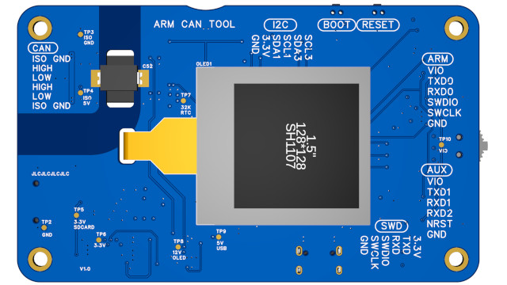
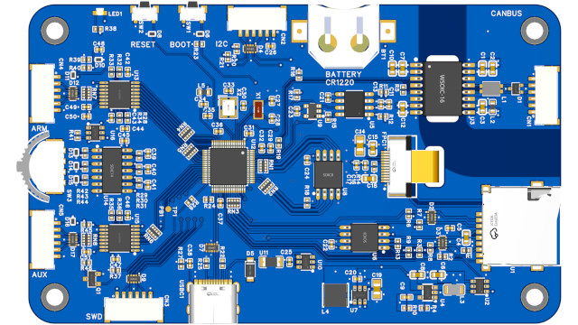
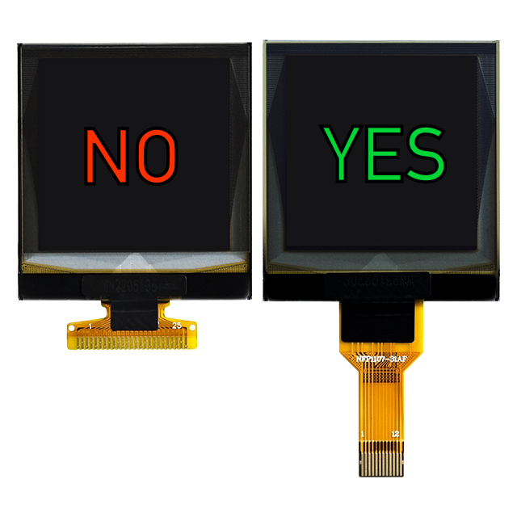
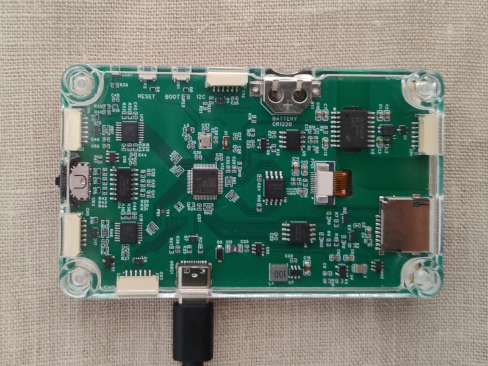

# ARM CAN TOOL — Manufacturing

**Hardware Revision:** v1.0

## PCB Assembly

The PCB is designed for JLCPCB Economy PCBA. All components are SMD. The board leaves assembly fully soldered — no post-assembly soldering is required.

The complete hardware design — schematic, PCB layout, BOM, and pick-and-place files — is published on OSHWLab: [oshwlab.com/koendv/arm_can_tool](https://oshwlab.com/koendv/arm_can_tool).

[](pictures/3d_pcb_front.png)

*PCB front.*

[](pictures/3d_pcb_back.png)

*PCB back.*

### JLCPCB Ordering Procedure

1. Open the OSHWLab project and export the manufacturing files (Gerbers, BOM, pick-and-place).
2. Upload to [jlcpcb.com](https://jlcpcb.com) and select the following options.

| Option | Value |
| ------ | ----- |
| Stackup | JLC04161H-7628 |
| Mark on PCB | Order Number (Specify Position) |
| PCBA Qty | 2 or 5 |
| PCBA Remark | NO SOLDER PASTE ON MIDDLE PAD OF BATTERY HOLDER C964818 |

> **Order number position:** The PCB design places the JLCPCB order number outside the isolation barrier.

Silkscreen ink within the CAN bus isolation barrier reduces the maximum allowable isolation voltage. Do not place any text in the CAN bus isolation barrier.

> **No ultrasonic cleaning:** The SD8931 RTC contains an internal crystal. Ultrasonic cleaning will damage the crystal. Do not request ultrasonic board cleaning.

> **Component stock:** Before ordering, verify all components are in stock. If a component is out of stock, select a substitute and document the substitution in the schematic. For repeat orders, use the JLCPCB "repeat order" option to preserve previous component selections.

---

## Component Sourcing

Three components require attention:

- Processor
- OLED display
- CAN bus transceiver

Stock management:

- Maintain a personal parts library at JLCPCB sufficient for the assembly run.
- For out-of-stock JLCPCB components, use the LCSC "Notify Me" function to receive email notification when stock is restored.

Components for JLCPCB assembly are:

- [JLCPCB stock](https://jlcpcb.com/parts)
- [LCSC stock](https://www.lcsc.com/) (a JLCPCB sister company)
- JLCPCB [global sourcing](https://jlcpcb.com/help/article/how-to-use-jlcpcb-global-sourcing-parts-service) (Digikey, Mouser, ...)
- [consigned](https://jlcpcb.com/help/article/how-to-consign-parts-to-jlcpcb) - the customer supplies the component

### Processor — AT32F405

The AT32F405 is the probe MCU. LQFP-64, 7×7 mm body. Manufacturer part number: AT32F405RCT7-7.

Three sources:

| Source | Link |
| ------ | ---- |
| LCSC (singles or full tray of 250) | [LCSC C19674180](https://www.lcsc.com/product-detail/C19674180.html) |
| JLCPCB (PCB assembly) | [JLCPCB C19674180](https://jlcpcb.com/partdetail/ARTERY-AT32F405RCT77/C19674180) |
| JLCPCB (consigned part) | [JLCPCB C9900094935](https://jlcpcb.com/partdetail/JLCPCBAssembly-AT32F405RCT77/C9900094935) |

The same part (AT32F405RCT7-7) has two different JLCPCB part numbers:

- C19674180 when JLCPCB supplies it from stock.
- C9900094935 when the customer consigns it.

**Consignment procedure (users outside China):**

- Purchase via a Chinese purchasing agent (e.g. [superbuy.com](https://superbuy.com)) from [taobao.com](https://taobao.com).
- Instruct purchasing agent to forward to the JLCPCB warehouse, using address in Chinese.
- Follow [JLCPCB consignment instructions](https://jlcpcb.com/help/article/how-to-consign-parts-to-jlcpcb) exactly.

Cost reference: USD 17.50 for 10 units (2025).

### CAN Bus Transceiver

| Part | Notes |
| ---- | ----- |
| [C5271191 CA-IS2062VW](https://jlcpcb.com/partdetail/Chipanalog-CAIS2062VW/C5271191) | CAN 2.0. Primary. Use if available. |
| [C5338808 CA-IS3062VW](https://jlcpcb.com/partdetail/Chipanalog-CAIS3062VW/C5338808) | CAN 2.0. Drop-in replacement. |
| [C49450889 NSIP9042-DSWR](https://jlcpcb.com/partdetail/NOVOSENSE-NSIP9042DSWR/C49450889) | CAN FD. Identical footprint and pinout. Datasheet-compatible; not yet tested in hardware. |

For full electrical comparison, see [HARDWARE.md#can-bus-transceiver](HARDWARE.md#can-bus-transceiver).

### OLED Display

| Parameter | Value |
| --------- | ----- |
| Part number | ZJY150-2828KSWKG03 |
| Controller | SH1107 |
| Size | 1.5 inch, 128×128 pixels, monochrome |
| Interface | SPI |
| Connector | Plug-in FPC, 12 pins, 0.5 mm pitch, top connection |
| Datasheet | [ZJY150-2828KSWKG03.pdf](Hardware/V1.0/6_DOC/datasheets/ZJY150-2828KSWKG03.pdf) |

⚠️ **Warning — two variants exist with incompatible connectors.** Order only the 12-pin plug-in FPC variant (插接式裸屏 排针默认不焊接推荐). The 25-pin soldering FPC variant is not compatible with this PCB.

| Variant | Connector | Compatible |
| ------- | --------- | ---------- |
| Plug-in FPC, 12 pins, 0.5 mm pitch | ✓ Correct | Yes |
| Soldering FPC, 25 pins, 0.65 mm pitch | ✗ Wrong | No |



| Platform | Link |
| -------- | ---- |
| Taobao (item) | [item.taobao.com/item.htm?id=676644812043](https://item.taobao.com/item.htm?id=676644812043) |
| Taobao (manufacturer store) | [oled-zjy.taobao.com](https://oled-zjy.taobao.com) |
| Alibaba | [product listing](https://www.alibaba.com/product-detail/1-5-inch-OLED-display-module_1601054555841.html) |
| AliExpress | [product listing](https://www.aliexpress.com/item/1005007579159330.html) |

Cost reference: USD 3.50 per unit (2025).

> The OLED display is not included in the PCB assembly order. It is installed manually in the final assembly step.

---

## Final Assembly

[](pictures/assembly_big.jpg)

The PCB arrives fully soldered from JLCPCB. Two manual steps are required: attaching the OLED display and closing the enclosure.

### Bill of Materials

| Item | Quantity |
| ---- | -------- |
| Assembled PCB | 1 |
| OLED display (ZJY150-2828KSWKG03) | 1 |
| Enclosure — display side | 1 |
| Enclosure — component side | 1 |
| M3×10 nylon screws | 4 |
| M3 nylon nuts | 4 |
| 3M VHB sticker, 30×30×1 mm | 1 |
| Self-adhesive rubber feet, 6 mm diameter (optional) | 4 |

### Quality Verification

The side of the PCB without components has 1 mm test pads to measure power supplies and CAN bus isolation.

See [Hardware Tests](HARDWARE.md#hardware-tests) for post-assembly tests.

### OLED Installation

The OLED position is marked on the PCB. When the OLED is placed on the marked position, the flex cable reaches the FPC connector exactly, with the bend at the midpoint of the flexible section. A Kapton tape hinge facilitates accurate placement.

1. Clean the OLED bonding area on the PCB with IPA. Allow to dry before proceeding.
2. Place 3M VHB sticker on the display side of the PCB at the marked OLED position. Do not remove the adhesive liner yet.
3. Position the OLED display on the marked position.
4. Apply a strip of Kapton or masking tape along one edge of the OLED to create a hinge.
5. Flip the OLED up using the hinge. Remove the adhesive liner from the sticker.
6. Flip the OLED back down onto the PCB using the hinge.
7. Place PCB OLED-side down on a flat hard surface.
8. Apply pressure for 20 seconds.
9. Thread the OLED flex cable through the slot in the PCB.
10. Pull out the locking tab on the FPC connector. Insert the flex cable flat side down. Push the locking tab back in to secure.

3M VHB sticker cure time: 72 hours.

### Enclosure Assembly

1. Thread each M3 nylon nut onto its corresponding M3×10 screw.
2. Press each nut into the nut trap in the enclosure. The fit is tight — the nut should not fall out when the screw is removed.
3. Remove the screws. Place the PCB assembly into the component-side enclosure.
4. Place the display-side enclosure over the PCB.
5. Insert and tighten the four M3×10 screws.
6. Attach the four self-adhesive rubber feet to the base (optional).

Verification: The OLED display is visible through the display-side opening. All connectors are accessible at the enclosure edges.

### Assembly Fixture

For multi-unit production, a 3D-printable fixture accurately positions the OLED display during installation. OpenSCAD source files are in `tools/fixture/`.

---

## 3D Printed Enclosure

The enclosure consists of two parts — display side and component side — connected with four M3×10 nylon screws and nuts. The PCB is a structural element providing the enclosure with its stiffness.

Case dimensions: 60×100×14 mm.

### Generating STL Files

STL files are exported from EasyEDA Pro.

1. Open the EasyEDA Pro project and open the PCB.
2. Select **Export → 3D Shell File → STL → Export**.

EasyEDA exports a zip file named `3DShell_PCB1.zip` containing two STL files:

```
$ unzip 3DShell_PCB1.zip
  inflating: 3DShell_3DShell_PCB1_T.stl
  inflating: 3DShell_3DShell_PCB1_B.stl
```

`_B` (bottom) is the display-side enclosure. `_T` (top) is the component-side enclosure.

3. Repair the STL files before submitting for printing. EasyEDA exports may contain geometry errors that cause print failures. Upload each file to an online STL repair service such as [formware.co/onlinestlrepair](https://www.formware.co/onlinestlrepair).
4. Submit the repaired files to [jlc3dp.com](https://jlc3dp.com) or PCBWay for SLA printing.

### Material Selection

Two options:

- For lowest cost, print both halves in white 9600 resin (~USD 1.50, cheapest resin).
- For ease of use, print the display side in transparent 8100 resin and the component side in white 9600 resin — the transparent half allows reading connector pin labels. (~USD 4.50)

| Side | Colour | jlc3dp material | PCBWay material | Notes |
| ---- | ------ | --------------- | --------------- | ----- |
| Display | Transparent | 8100 resin | UTR-8100 | Transparent allows reading connector labels on PCB silkscreen |
| Component | White | 9600 resin | UTR-8360 | Standard SLA resin |

> **High-temperature environments:** The standard resins (8100, 9600) begin to deform at 53°C–59°C. For high-temperature environments — such as a vehicle dashboard in direct sunlight — use heat-resistant materials: JLC Temp Resin (jlc3dp, 101°C) or Somos Perform (PCBWay, 122°C). Nylon is also suitable but has a coarser surface finish.

### Prototype Enclosure

For prototyping and fit verification, print the display-side enclosure in clear SLA resin (8100 resin). A transparent enclosure allows visual inspection of component clearances and connector alignment without disassembly.

[](pictures/back_big.jpg)

*Prototype enclosure in clear SLA resin.*

### OLED Window (Optional)

A clear window may be installed over the OLED display opening to protect the display from dust and debris.

| Parameter | Value |
| --------- | ----- |
| Material | PMMA (acrylic) or polycarbonate |
| Size | 50×50 mm |
| Thickness | 1 mm (2 mm presses against the display) |

Installation:

1. Locate the three positioning bumps on the inside of the display-side enclosure.
2. Place the window against all three bumps to centre it over the display.
3. Secure with OTA (optically transparent adhesive) or thin, non-spongy double-sided tape (2–3 mm wide, mobile phone repair type) applied to the enclosure, not to the display.

---

## Firmware Installation

The board leaves PCB assembly with no firmware installed. Firmware must be installed before the unit can be used or tested.

Install the UF2 bootloader and application firmware following the procedure in [INSTALL.md](INSTALL.md).

