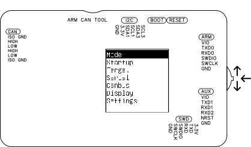
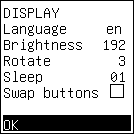
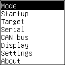
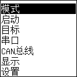
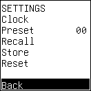
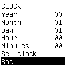
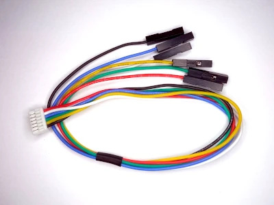
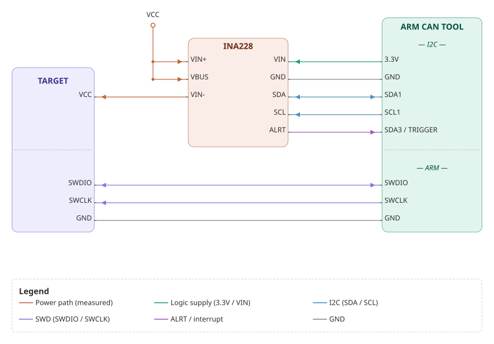

# ARM CAN TOOL — Operation

## Navigate Menus



The OLED display and multi-direction switch form the menu system.

Multi-direction switch inputs:

- **Rotate Up** — Moves cursor to previous item. Wraps to last item if at top.
- **Rotate Down** — Moves cursor to next item. Wraps to first item if at bottom.
- **Press** — Confirms highlighted selection. Enters submenu, executes function, toggles setting, or confirms value change.

### Navigate a Menu

1. Rotate to move the highlight.
2. Press to enter submenu or activate setting.

### Adjust a Value

1. Rotate to change value.
2. Press to confirm. Device returns to parent menu.

### Return to Parent Menu

Every menu contains one or two items at the bottom:

- **Back** — Returns to previous menu. No settings changed. No action performed.
- **OK** — Applies settings or executes action. Device returns to previous menu.

Rotate to highlight Back or OK. Press to select.

### Wake from Sleep Mode

The screen turns off after a period of inactivity. This is sleep mode.

When display is sleeping:

- First rotation or press wakes the device only. Selection and values do not change.
- Second input navigates or confirms.

---

## Configure Display Settings



Display menu settings:

| Setting | Values |
|---|---|
| language | English, Chinese |
| brightness | 0–255 |
| rotate | 0–3 (0 = no rotation, 1 = 90°, 2 = 180°, 3 = 270°) |
| sleep | Inactivity in minutes before screen turns off |
| swap buttons | Swaps up and down rotation of multi-direction switch |

Brightness change applies immediately. All other settings require reboot.

Rotation and swap buttons are useful for left-handed use.

 

1. Navigate to Display.
2. Adjust settings.
3. Rotate to highlight OK. Press to confirm.

Device saves all settings to EEPROM and reboots.

Verification: Device boots with updated display settings.

---

## Save and Restore Settings



Settings changed through the menu are held in volatile memory until saved.

| Action | Behavior |
|---|---|
| Settings → Store | Saves all current settings to EEPROM. No reboot |
| Settings → Recall | Restores settings from EEPROM. Discards unsaved changes. No reboot |
| Changing Mode | Saves all settings to EEPROM. Reboots immediately |
| Confirming Display settings | Saves all settings to EEPROM. Reboots immediately |

Settings are restored from EEPROM at each boot.

The device stores up to 16 presets, numbered 0–15. Device always boots from preset 0.

### Store Settings

1. Navigate to Settings → Preset.
2. Set Preset to target slot number (0–15).
3. Navigate to Settings → Store.

Verification: Settings retained in selected preset slot after reboot.

If Preset is set to 0: settings take effect at next boot.

### Recall Settings

1. Navigate to Settings → Preset.
2. Set Preset to target slot number (0–15).
3. Navigate to Settings → Recall.

Verification: Settings loaded from selected preset slot.

---

## Reset to Factory Defaults

1. Navigate to Settings → Reset. Settings reset to default in volatile memory.
2. Navigate to Settings → Store. Default settings overwrite saved settings in EEPROM.
3. Press RESET or disconnect USB to reboot.
4. After reboot, navigate to Settings.

Verification: All values are at default.

---

## Boot with Default Settings (Recovery)


Use this when:

- Lua autoexec script is hanging or looping.
- Display language is set to an unknown language.
- Settings struct has changed after firmware update and device behaves unexpectedly.

Booting with default settings does not overwrite saved settings. Saved settings are preserved.

Booting with default settings does not reset system clock time.

1. Rotate multi-direction switch clockwise.
2. Press RESET. Hold RESET.
3. Wait approximately 1 second. Release RESET.
4. Wait approximately 1 second. Release multi-direction switch.

Device boots with default settings.

Verification: Device operates normally. Saved settings remain unchanged on next normal boot.

---

## Set System Clock



1. Navigate to Settings → Clock.
2. Set system time.

The system clock requires a CR1220 battery to persist when not connected to USB.

Verification: Clock retains correct time after power cycling.

---

## Change Operating Mode

The device operates in one of four modes. Each mode presents a different set of USB interfaces. Mode is stored in EEPROM and restored at each boot. Changing mode reboots immediately.

Navigate to Mode to view and change current mode.

| Mode | Debug Interface | CAN Interface | USB Interfaces |
|---|---|---|---|
| GDB Server | Black Magic Debug | GS-USB / SocketCAN | GS-USB bulk, CDC serial (log), CDC serial (GDB) |
| CMSIS-DAP | CMSIS-DAP v2 | SLCAN | CMSIS-DAP bulk, CDC serial (log), CDC serial (SLCAN) |
| Mass Storage | — | — | USB mass storage (SD card), CDC serial (rt-thread shell) |
| Lua Script | Lua | Lua | CDC serial (Lua shell), CDC serial (user I/O) |

Changing mode saves all settings to EEPROM and reboots immediately.

### Mass Storage Mode

Mass Storage Mode is a maintenance mode. In Mass Storage Mode, no debugging takes place, and no data is written to the SD card. Instead, Mass Storage Mode exports the SD card as a USB mass storage device, and exports the rt-thread shell as a USB CDC serial device.

Connect a terminal emulator to the CDC serial. The rt-thread `msh` shell prompt appears.

```
$ minicom -D /dev/ttyBmpCon
...
msh />ldf
Filesystem   1K-blocks      Used Available Use% Mounted on
devfs            65536         0     65536   0% /dev
part0            16384         8     16376   0% /flash
```

The `/sdcard` filesystem is not available in Mass Storage Mode, because the SD card is exported over USB.
The serial console is not available when the console is switched to USB serial.
rt-thread has only one active console device at a time.

---

## About

Navigate to About to see compilation date and free RAM.

---

## Connectors

All connectors are JST GH1.25 6-pin. Use silicone JST GH1.25 to DuPont 2.54 cables.

[](pictures/target_cable.jpg)

### ARM Connector

ARM connector connects to target SWD and target serial console.

Connect GND to target ground. Connect VIO to target logic voltage.

SWD use:

- SWCLK / SWDIO → target SWD
- TXD0 / RXD0 → target console

Set TXD0/RXD0 speed: Serial → Serial0.

To swap TXD0 and RXD0 without changing cables: Serial → Serial Enable → swap txd rxd.

JTAG use:

- TXD0 / RXD0 → TDI / TDO
- TXD1 / RXD1 → serial1 (always available)

⚠️ **Warning — serial0 in JTAG mode:** In JTAG mode, pins TXD0 and RXD0 carry TDI and TDO. Enabling serial0 in JTAG mode causes driver conflict. Do not enable serial0 in JTAG mode: Serial → Serial Enable → serial0 → Off.

### AUX Connector

AUX connector contains:

- serial1: TXD1, RXD1
- serial2: RXD2 (receive only)
- target reset: NRST (resets target)

Serial2 is receive only. Use for SWO or as serial port logger.

### SWO Decode

1. Connect target SWO pin to AUX connector pin 4.
2. Set speed: Serial → serial2 speed.
3. Enable serial2: Serial → Serial Enable → serial2 → On.
4. Connect terminal emulator to `/dev/ttyBmpTarg` (CDC serial 0).

Verification: With target running, decoded SWO output appears in terminal emulator.

### SWD Connector

SWD connector is used to debug the debugger. Connect another debugger to the AT32F405 processor via this port.

rt-thread console is on TXD/RXD pins. Baud rate: 115200 bit/s.

### CAN Connector

CAN connector is electrically isolated from the rest of the device.

Connect ISO GND to CANBUS ground, even when CANBUS ground is target ground.

The device has no internal 120 Ω terminating resistors. If used as end node: add a 120 Ω resistor between HIGH and LOW using a JST GH1.25 to DuPont 2.54 cable.

### I2C Connector

I2C connector operates in two configurations:

- Two independent I2C buses: I2C1 and I2C3
- One I2C bus (I2C1) and two GPIO pins (e.g., ALERT and I2C_RST)

Bus I2C1 contains two devices:

- Settings EEPROM: address 0x50
- RTC: address 0x68

Bus I2C3 is free.

### External Trigger Input

External trigger halts the target when pin PC1 is pulled low. With external trigger enabled and target running, pulling pin PC1 low is the same as typing Ctrl-C at the GDB prompt.

PC1 is I2C3_SDA on the I2C connector.

⚠️ **Note — I2C3 unavailable:** When external trigger is enabled, I2C3 is not available.

Enable external trigger:

1. Navigate to Startup → trigger → On.
2. Navigate to Settings → Store.
3. Reboot.

Verification: External trigger halts target when PC1 is pulled low.

---

## Breakpoint On Overcurrent



Use [INA228 I2C Power Monitor](https://learn.adafruit.com/adafruit-ina228-i2c-power-monitor/) to measure target current. Connect INA228 ALERT output to external trigger input. Use external trigger to trigger breakpoint when target current exceeds preset value.

## USB Serial Data

### Output: Tool to PC (CDC0 and CDC1)

In GDB Server mode:

| Port | Data |
|---|---|
| CDC0 | serial0–2, RTT, SWO, memwatch, CAN bus logging |
| CDC1 | GDB server |

CDC0 is tuned for output with more transmit buffers than CDC1.

### Input: PC to Tool

Characters typed in a terminal emulator connected to CDC0 (`ttyBmpTarg`) are sent to the device selected in Serial → usb out.

Options for Serial → usb out:

- serial0
- serial1
- rtt

---

## Enable Target Power

⚠️ **Warning — power contention:** Enabling 3.3 V Power when target has an independent supply causes both sources to contend on VIO. Will cause damage to target or device. Enable 3.3 V Power only when target has no independent supply on VIO.

### Enable via Menu

1. Navigate to Target → 3.3V Power → On.
2. Navigate to Settings → Store.

Verification: 3.3 V present on VIO pin when target is connected.

### Enable via GDB

```
(gdb) monitor tpwr enable
```

### Disable via GDB

```
(gdb) monitor tpwr disable
```

If target is powered externally: VIO is used to configure logic translators only.

---

## Enable Watchdog

Watchdog reboots the device if system becomes unresponsive. Timeout: 20 seconds.

1. Navigate to Startup → Watchdog → On.
2. Navigate to Settings → Store.
3. Reboot.

Verification: Watchdog shown as enabled in Startup menu after reboot.

---

## Configure Startup Services

Startup services initialize automatically at boot when enabled.

| Service | Description |
|---|---|
| CAN bus | Enables CAN bus interface at boot. Otherwise, CAN bus is enabled when the host opens gs_usb or SLCAN. |
| debugger | Connects to processor on SWD bus. Same as `monitor swd_scan` then `attach 1` |
| memwatch | Enables variable watchpoints as configured using `mon memwatch` |
| lua autoexec | Executes Lua autoexec script from internal flash at boot |
| logging | Enables SD card logging of all active output channels |
| rtt | Activates RTT output. Same as `monitor rtt` |
| swo | Activates SWO decode. Same as enabling SWO decode in the Debug menu |
| watchdog | Enables 20-second watchdog timer |
| trigger | Enables external trigger on I2C connector pin I2C3_SDA |

1. Navigate to Startup.
2. Enable or disable required services.
3. Navigate to Settings → Store.
4. Reboot.

Verification: Enabled services are active after reboot.
