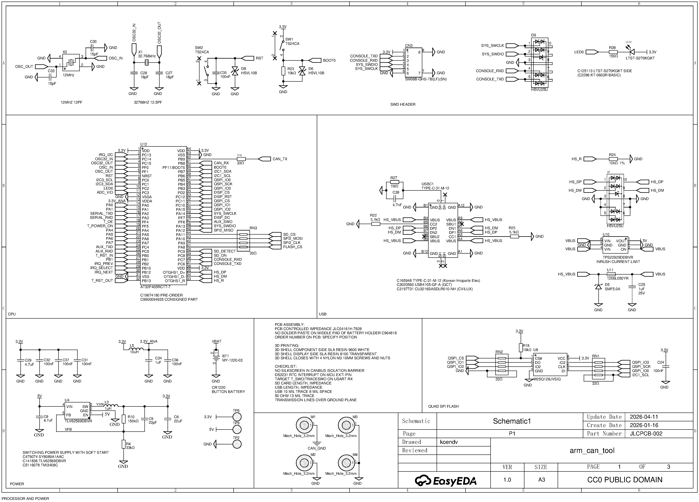
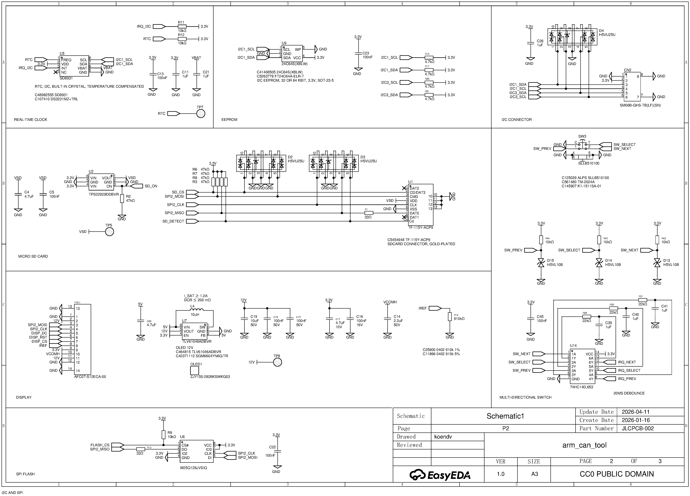
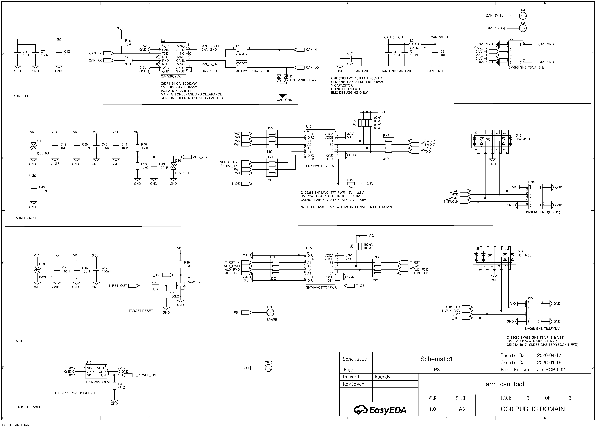

# ARM CAN TOOL — Schematic

<!--
Schematic bitmaps documented in tools/mkepub.sh
-->

Hardware revision v1.0. CC0 Public Domain.

Full hardware project: [oshwlab.com/koendv/arm_can_tool](https://oshwlab.com/koendv/arm_can_tool)

## Processor and Power

## I2C and SPI

## Target and CAN Bus

