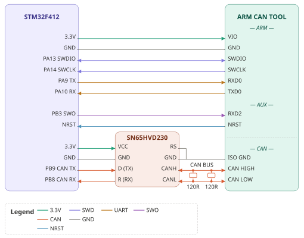

# ARM CAN TOOL — Tutorial: 5-Way Logging

Demonstrates simultaneous capture of five debug streams — serial console, RTT, SWO, CAN bus, and variable watchpoints — in a unified log, live over USB and recorded to SD card.

**Target firmware:** `tools/Arduino/FiveWay/` (STM32F412)

**Time estimate:** 15 minutes

**Host OS:** Linux (with udev rules from [INSTALL.md](INSTALL.md))

## Prerequisites

### Hardware

| Item | Description |
|------|-------------|
| ARM CAN Tool | Firmware v1.0+ |
| Target board | STM32F412 (WeAct CoreBoard used in examples) |
| Cables | JST GH 1.25 to DuPont 2.54, 6-pin |
| CAN transceiver | SN65HVD230 module or similar |
| SD card | FAT32 formatted |
| Termination resistor | 120 Ω (if CAN bus end node) |

### Host Software

| Tool | Installation |
|------|--------------|
| `arm-none-eabi-gdb` | [xPack GNU Arm Embedded GCC](https://github.com/xpack-dev-tools/arm-none-eabi-gcc-xpack) |
| `minicom` | `apt-get install minicom` |
| [Arduino IDE](https://www.arduino.cc) | With [STM32duino](https://github.com/stm32duino/Arduino_Core_STM32) core |

### Target Software

`tools/Arduino/FiveWay/` from the ARM CAN Tool repository. Compile using Arduino IDE or CLI.

Using the Arduino IDE:

- Select Tools->Board: `Generic STM32F4 series`, Tools->Part number `Generic F412RETx`.
- Enable **Optimize for Debugging** (Sketch → Optimize for Debugging).
- Compile and export: Sketch → Export Compiled Binary.

Or, using the Arduino cli:

```
arduino-cli compile -b STMicroelectronics:stm32:GenF4:pnum=GENERIC_F412RETX,opt=ogstd \
    --build-property "compiler.c.extra_flags=-g" \
    --build-property "compiler.cpp.extra_flags=-g" \
    --output-dir ~/Arduino/FiveWay/build \
    ~/Arduino/FiveWay
```

Choose IDE for ease of use; CLI for reproducible builds.

Note the .elf binary:

```
$  ls -l ~/Arduino/FiveWay/build/STMicroelectronics.stm32.GenF4/FiveWay.ino.elf
-rwxrwxr-x 1 koen koen 725832 Jun 28 17:28 /home/koen/Arduino/FiveWay/build/STMicroelectronics.stm32.GenF4/FiveWay.ino.elf
```

## Wiring



Connect between debugger and target:

- SWD serial wire debug
- RX/TX serial console
- SWO serial wire output
- NRST reset pin
- CAN bus

### ARM Connector → Target (SWD + Serial Console)

| ARM Connector (JST GH) | Target STM32F412 | Signal |
|------------------------|------------------|--------|
| Pin 1 (VIO) | 3.3V | Logic voltage |
| Pin 2 (TXD0) | PA10 (USART1_RX) | Target console TX |
| Pin 3 (RXD0) | PA9 (USART1_TX) | Target console RX |
| Pin 4 (SWDIO) | PA13 | SWD data |
| Pin 5 (SWCLK) | PA14 | SWD clock |
| Pin 6 (GND) | GND | Ground |

### AUX Connector → Target SWO

| AUX Connector | Target STM32F412 |
|---------------|------------------|
| Pin 4 (RXD2) | PB3 (SWO) |
| Pin 5 (NRST) | NRST |
| Pin 6 (GND) | GND |

### CAN Connector → CAN Transceiver

| CAN Connector | SN65HVD230 | Note |
|---------------|------------|------|
| Pin 1 or 6 (ISO GND) | GND | Must connect |
| Pin 2 (CAN\_HIGH) | CAN\_H | |
| Pin 3 (CAN\_LOW) | CAN\_L | |
| Pin 4 (CAN\_HIGH) | CAN\_H | 120  Ω to Pin 5 |
| Pin 5 (CAN\_LOW) | CAN\_L |  |


⚠️ **CAN bus ground required.** Because the arm can tool CAN bus is electrically isolated, the arm can tool CAN bus needs its own ground connection. Connect ISO GND (Pin 1 or 6) to CAN bus ground.

⚠️ **No internal termination.** The probe has no internal 120 Ω resistors.

**Termination:** If ARM CAN Tool is the only node or end node, add 120 Ω across CAN_HIGH and CAN_LOW at the connector. The SN65HVD230 breakout module has its own onboard 120 Ω termination, giving two terminations on the bus.

**Verification:** With no power applied, resistance between CAN_HIGH and CAN_LOW is approximately 60 Ω (two 120 Ω terminations in parallel).

### CAN Transceiver →  Target

| SN65HVD230 | Target | Note |
|---------------|------------|------|
| CAN RX | PB8 ||
| CAN TX | PB9 ||
| Pin 1 or 6 (ISO GND) | GND | Must connect |
| VCC | 3.3V ||


## Part 1: Tethered Mode — Live Logging to PC

Open two terminal windows:

| Terminal | Purpose | Command |
|----------|---------|---------|
| Window 1 | GDB session | `arm-none-eabi-gdb` |
| Window 2 | Target console (unified log) | `minicom -D /dev/ttyBmpTarg` |

If udev rules are not installed, find device names: `ls /dev/ttyACM*`

### Enable CAN Bus with Logging

```
OLED: Startup → CAN bus → On
OLED: CAN bus → speed → 500000
OLED: CAN bus → logging → On
OLED: Settings → Store
```

The CAN bus is started up as soon as the ARM CAN Tool is switched on. CAN bus frames are logged to `/dev/ttyBmpTarg` in linux `candump` format.

### Set GDB Server Mode

```
OLED: Mode → GDB SERVER → OK
```

Probe saves settings and reboots.

### Connect GDB

```bash
arm-none-eabi-gdb
(gdb) target extended-remote /dev/ttyBmpGdb
```

### Scan and Attach

```bash
(gdb) monitor swd_scan
```

Verification:
```
Target voltage: 3.3V
Available Targets:
No. Att Driver
 1      STM32F412 M4
```

```bash
(gdb) attach 1
(gdb) file ~/Arduino/FiveWay/build/STMicroelectronics.stm32.GenF4/FiveWay.ino.elf
(gdb) load
Loading section .isr_vector, size 0x1c4 lma 0x8000000
Loading section .text, size 0x69dc lma 0x80001d0
Loading section .rodata, size 0xa64 lma 0x8006bac
Loading section .ARM, size 0x8 lma 0x8007610
Loading section .init_array, size 0x14 lma 0x8007618
Loading section .fini_array, size 0xc lma 0x800762c
Loading section .data, size 0x108 lma 0x8007638
Start address 0x08005778, load size 30516
Transfer rate: 10 KB/sec, 847 bytes/write.
```

The `load` gdb command writes the firmware `FiveWay.ino.elf` to the target `STM32F412`.

**Verification:**

```
(gdb) compare-sections
Section .isr_vector, range 0x8000000 -- 0x80001c4: matched.
Section .text, range 0x80001d0 -- 0x8006bac: matched.
Section .rodata, range 0x8006bac -- 0x8007610: matched.
Section .ARM, range 0x8007610 -- 0x8007618: matched.
Section .init_array, range 0x8007618 -- 0x800762c: matched.
Section .fini_array, range 0x800762c -- 0x8007638: matched.
Section .data, range 0x8007638 -- 0x8007740: matched.
```

The `compare-sections` gdb command reads the firmware back from target flash memory, calculates checksums, and compares with the checksums of the .elf binary.

### Find Variable Address for Watchpoint

```bash
(gdb) print &count
```

Verification:
```
$1 = (uint32_t *) 0x20000124 <count>
```

⚠️ **Use the address from GDB output, not the address above.** Compiler options or code changes will shift the address.

If GDB reports `No symbol "count" in current context`: the firmware was not compiled with debug symbols. Enable **Optimize for Debugging** in Arduino IDE (Sketch → Optimize for Debugging → Debug) and recompile.

If recompiling with debug symbols is not possible, the variable address can be found in the linker map file (`.map`) and used directly in the `mon memwatch` command.

### Configure Watchpoint

```bash
(gdb) mon memwatch count /d 0x20000124
```

⚠️ **Use the address from GDB output, not the address above.** Compiler options or code changes will shift the address.

### Enable RTT

```bash
(gdb) mon rtt enable
(gdb) mon rtt status
```

Verification: `rtt: on found: no`

After running program, and stopping with ctrl-c: `rtt: on found: yes`

### Configure SWO Decoding

SWO is _serial wire output_.


```
OLED: Serial → serial2 speed → 1000000
OLED: Serial → Serial Enable → serial2 → On
```

In `arm-none-eabi-gdb`:

```
(gdb) mon swo enable 1000000 decode
Channel mask: 11111111111111111111111111111111
```

The channel mask indicates all SWO channels are displayed.

### Run Target

```bash
(gdb) run
```

Verification: Target LED blinks.

### Observe Unified Log

Window 2 shows all five streams interleaved:

```
serial: 1
rtt: 1
count 1
swo: 1
(38.031027) can0 101#00000001
serial: 2
rtt: 2
count 2
swo: 2
(39.016001) can0 102#00000002
...
```

The CAN bus timestamps are seconds since ARM CAN Tool boot.

Verification:

| Stream | Expected output |
|--------|----------------|
| Serial console | `serial: N` |
| RTT | `rtt: N` |
| SWO | `swo: N` |
| Watchpoint | `count N` |
| CAN bus | CAN packet in candump format |

Halt the target by typing ctrl-C in `arm-none-eabi-gdb`:

```
^C
Program received signal SIGINT, Interrupt.
(gdb) where
#0  getCurrentMillis ()
    at /home/koen/.arduino15/packages/STMicroelectronics/hardware/stm32/2.12.0/libraries/SrcWrapper/src/stm32/clock.c:51
#1  0x08005952 in delay (ms=1000)
    at /home/koen/.arduino15/packages/STMicroelectronics/hardware/stm32/2.12.0/cores/arduino/wiring_time.c:43
#2  0x0800048e in loop () at /home/koen/Arduino/FiveWay/FiveWay.ino:61
#3  0x08005772 in main ()
    at /home/koen/.arduino15/packages/STMicroelectronics/hardware/stm32/2.12.0/cores/arduino/main.cpp:58
```

Above output indicates the program was interrupted in `FiveWay.ino`, line 61, `delay(1000)`. Output may differ.

```
(gdb) mon rtt status
rtt: on found: yes ident: off halt: off channels: auto 0 1 3
max poll ms: 256 min poll ms: 8 max errs: 10
(gdb)
```

`rtt: on found: yes` indicates RTT is working fine.

In gdb server mode, list all available commands:

```
(gdb) mon help
```

Note some commands are only available after attaching to target.

### Filtering CAN Bus Addresses

Download [canfilter](https://github.com/koendv/canfilter).

Select CANBUS -> canfilter -> On

Filter CAN bus addresses 0x100 to 0x107:

```
$ canfilter -u 1209:8816 0x100-0x107 -v
usb device open success
Using bxCAN (F0/F1/F3) with 14 filter banks
bxcan std mask id 0x100 mask 0x7f8

Filter usage: 1/14 (7%)
usb programming success
```
Select Settings -> Store.

Push arm can tool reset button.

Note only CAN bus addresses 0x100 to 0x107 are logged.

To allow all CAN bus addresses:

```
$ canfilter -u 1209:8816 -a
```
Select Settings -> Store.

Select CANBUS -> canfilter -> Off.

Push arm can tool reset button.

## Part 2: Standalone Mode — Autonomous SD Card Logging

### Configure Startup Services

Navigate and enable each:

| Service | Menu path |
|---------|---------------------|
| Auto-attach | `Startup → debugger` |
| RTT | `Startup → rtt` |
| Watchpoint | `Startup → memwatch` |
| SD logging | `Startup → logging` |
| CAN bus | `Startup → CAN bus` |
| CAN logging | `CAN bus → logging` |

### Save Current Configuration

```
OLED: Settings → Store
```
Saves in EEPROM: GDB Server mode, CAN speed, watchpoint address, serial/SWO speeds, CAN filter settings, Startup.

### Insert SD Card

FAT32 or exFAT format required.

### Reboot

Press RESET or power cycle.

If target power is enabled (`Target → 3.3V Power`), the probe waits 5 seconds for power to settle before attempting to attach.

Verification: Target LED blinks

### Retrieve Logs

The log is flushed every 120 seconds (LOG\_SYNC\_SECONDS). Wait five minutes. Then:

```
OLED: Mode → MASS STORAGE → OK
```

SD card appears as USB mass storage. Example:

```
koen@nuc:/media/koen/DF2B-4229$ ls
6a41d61c.log  rtthread.log
```

Two log files:

- `rtthread.log`: rt-thread console log
- `6a41d61c.log`: unified debug log - serial console, rtt, swo, watchpoint, CAN bus. Filename is number of seconds since January 1, 1970, in hex.

⚠️ **Probe will not debug while in Mass Storage mode.** Return to GDB Server mode via `Mode → GDB SERVER → OK` when done.

Verification: log file contains all five interleaved streams, identical in format to tethered output.

**Log rotation:** When log file reaches ~4 MB (LOG_SIZE_MAX), probe creates new log file and continues.

## Troubleshooting

### Probe Console

The probe runs rt-thread OS. The rt-thread console is available on the SWD connector (TXD/RXD pins) at 115200 baud, independent of target output. Use it to diagnose probe-side and target startup issues.

Mode gdb server, Startup->debugger->on, Startup->RTT->on, Startup->SWO->on. Expected output at boot:

```
102k ram
app

 \ | /
- RT -     Thread Operating System
 / | \     5.3.0 build Jul 20 2026 09:39:27
 2006 - 2024 Copyright by RT-Thread team
[u8g2] Attach device to spi22
I/SWD: ramfunc 3700 byte
I/EEPROM: settings 404 byte
I/SFUD: rom mount to '/'
I/SFUD: Found a flash chip. Size is 16777216 bytes.
I/SFUD: norflash0 flash device initialized successfully.
I/SFUD: Probe SPI flash norflash0 by SPI device spi20 success.
I/SFUD: spi flash mount to /flash
I/SD: sd card mount to /sdcard
I/USB: init
I/LED: init
I/CAN: speed 500000
I/CAN: event init
I/CAN: init
I/GSUSB: init
I/GSUSB: waiting
I/UART: uart2 speed 115200
I/UART: uart3 speed 115200
I/SWO: uart7 speed 1000000
I/STARTUP: attached
I/STARTUP: rtt
I/STARTUP: target running
I/SWO: init
I/MAIN: ready
msh />
```

See [boot log](REFERENCE.md#boot-log) for expected output without debugger, RTT and SWO started up at boot.

If the target is not yet powered at probe boot, `E/STARTUP: swd scan failed` is printed instead of `I/STARTUP: attached`, followed by a retry. Up to five retries are attempted before giving up.

| Symptom | Cause | Solution |
|---------|-------|----------|
| Probe console shows `swd scan failed`, no retry | Target not powered or wiring fault | Verify VIO (ARM pin 1), SWDIO, SWCLK, GND |
| Probe console shows `attach retry 5/5`, no `attached` | Target unresponsive | Check target power, reset target, verify SWD wiring |

### Common Symptoms

| Symptom | Cause | Solution |
|---------|-------|----------|
| `Target voltage: 0.000V` | VIO not connected | Check ARM pin 1 to target 3.3V |
| SWD scan finds no target | Wiring or power | Verify GND, SWCLK, SWDIO connections |
| SWO shows garbled output | Baud rate mismatch | Ensure `SWOStream swo(1000000)` matches `serial2 speed` |
| No CAN logs | Missing termination | Add 120 Ω resistor across CAN_HIGH/CAN_LOW |
| Watchpoint shows nothing | Wrong address | Re-run `p &count` after firmware changes |
| SD card not mounted | Format issue | Use FAT32 or exFAT, not  NTFS |
| Log file empty | Logging not enabled | Verify `Startup → logging` is On |
| Device not found at `/dev/ttyBmp*` | udev rules not installed | Use `ls /dev/ttyACM*` to find port |

## Summary

Five simultaneous debug streams captured in a unified log:

| Stream | Transport |
|--------|-----------|
| Serial console | Target UART |
| RTT | Segger Real-Time Transfer |
| SWO | ITM trace |
| CAN bus | Isolated CAN 2.0 frames |
| Variable watchpoint | Live memory monitoring |

## Next Steps

- **RTT channel filtering** — See [DEBUG.md](DEBUG.md)
- **SWO port filtering** — See [DEBUG.md](DEBUG.md)
- **CAN ID filtering** — See [CANBUS.md](CANBUS.md)
- **Multiple watchpoints and format specifiers** — See [DEBUG.md](DEBUG.md)
- **Watchpoint timestamps** — See [DEBUG.md](DEBUG.md)
- **Lua scripting for standalone automation** — See [SCRIPT.md](SCRIPT.md)
- **Log file formats and retrieval** — See [LOGGING.md](LOGGING.md)
- **Additional startup services** (SWO decode, Lua autoexec, watchdog, trigger) — See [OPERATION.md](OPERATION.md)
